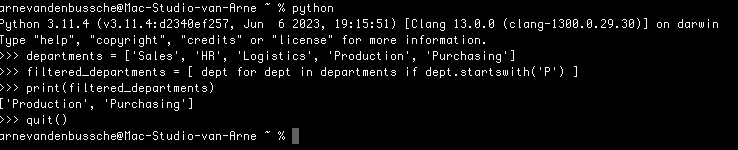

# Introduction

## Objectives of this chapter

After studying this chapter, you will have some idea of what Python is, what the specific features of Python are.
You will also know what tools we use. After studying this chapter, you will have installed the necessary software and be able to start working in full swing in the next chapter.

## Objectives of this course

The aim of this course is to provide a solid introduction to Python. A course unit of three credits does not allow covering all aspects of Python. Our target audience here is not the full-stack developer, but any IT professional who can use Python in their speciality. So our focus is more on smaller projects.

- Scripts or small projects to automate repititive tasks.
- Automation of server tasks and security tasks.
- Data analysis.
- Algorithms for artificial intelligence.

Topics that we will therefore not cover, or will cover in a very limited way, are:

- Full-stack web development with frameworks such as Flask or Django.
- Desktop GUI applications with tools like Tkinter, PyQt5, wxPython, and so on.
- Developing or using APIs.

## Prior knowledge required

This is not a beginner's programming course. We expect every student in this course to already have a solid foundation in object-oriented programming in whatever language.

The course may start with the absolute basics of Python. Yet in this course, we will not explain what a variable is, how an iteration works, what an exception is, or what classes and objects are. We will assume that these concepts are already familiar.

## Characteristics of Python

### Generic language with a wide range of capabilities

On its own, Python is an older programming language, created by Dutchman Guido Van Rossem in the late 1980s. The active version at present is Python3 and its variants, created in 2008.

Python is a programming language with an ever-growing popularity and a large community. Python has a wide range of applications:

- Scripting to automate smaller repititive tasks, in various domains.
- Web development with frameworks such as Flask, Django and many others.
- Data processing and data analysis with libraries like Pandas, Numpy, Matplotlib.

- Desktop applications using libraries like Tkinter, PyQT and wxPython.
- Game development using libraries like Pygame for 2D games.
- IoT: Python is often used to programme smaller devices such as a Rapsberry Pi.
- Applications of data science and artificial intelligence with libraries and frameworks like skikit-learn, TensorFlow, Keras, PyTorch, NLTK.

### **Platform-independent** 

Python is also available on a wide range of platforms such as Windows, macOS, Linux, BSD.

### Strong in readability

Guido van Rossum developed Python because his job required him to use a scripting language that was very difficult to read and handle. A simple and readable syntax is part of Python's basic philosophy.

Python also does not use accolates or other symbols to structure code blocks, but indendation, the indentation of code. This forces the programmer to write readable code. The code example below illustrates this:

```python
def average(list):
    sum = 0
    counter = 0
    for number in list:
        sum += number
        counter += 1
    average_list = sum / counter
    return average_list

list_of_numbers = [10, 20, 30, 40, 50]
result = average(list_of_numbers)
print("The average is:", result)
```

### Dynamische, maar strikte typering

**Dynamic typing** means that you do not have to determine the data type in advance when declaring a variable as is common in C, C++, C# or Java. The type is inferred from the value assigned to the variable. The type is determined at runtime, rather than at compile-time.

Example:

```python
age = 25
```

By assigning an integer, Python currently determines the data type of the variable ‘age’. In this, Python is similar to Javascript.

Unlike Javascript, Python does not peform implicit type coercion in calculations or comparisons. When comparing variables or making calculations the data types are fixed. While Javascript will try to force type conversion when incompatible datatypes are used (e.g. make a sum between an integer and a string), while Python will raise an exception, a TypeError.

You can change the type of a variable by assigning  a value of another type to the variable.

### Interpreted, not compiled

Languages like C, C++, C# and Java are compiled languages, while a language like Python, like Javascript and PHP, is considered an interpreted language. A compiled language is first converted to machine language by a compiler and is then executable while an interpreted language is executed line by line by an ‘interpreter’.

The main difference is in the following example. If you try to access an undefined variable, Python will only detect this at runtime. You will get a NameError, while a compiled language such as Java will check wether a variable has been declared at compile time, so before you can even run the program.

However, we must admit that the distinction is not so strict any more. Python is also first compiled to bytecode behind the scenes and it is that bytecode that is executed by the interpreter. The compiled bytecode can be found in the mysterious `__pycache__` folder. This process is very similar to what happens in Java and C#, except that in those two languages an explicit compiler step must be performed before you can run the program.

### Object-oriented and functional

In a functional programming language there is an emphasis on functions that are "stateless", that do not change values, that have no side effects, but calculate en return an output based on an input. An object oriented language is based on classes, where object are instances of a class. Concepts such as inheritence and polymorphism are typtical properties of an objectoriented language.

Python support both paradigms. It allows developer to use functional programming features alongside object-oriented programming constructs.

## Tools

### Python

Our first tool is of course the Python interpreter. It is wise to install the interpreter from the official Python site: https://www.python.org/downloads/. It is possible that you already have a recent version of Python on your computer. You can test this by opening a terminal and run the following command:

```bash
$ python --version
```

You will get the version number of the Python installation on your computer:

```bash
$ Python 3.11.4
```

It is possible that you will have to use the command `python3` .

``` bash
$ python3 --version
```

For this course it is not necessary to have the latest version of Python. Version 3.8 or later should suffice.

You can run Python in several ways:

* Interactively;
* at the command line;
* in a Jupyter notebook.

Running Python in the **interactive way** is done by typing the command `python` or `python3` in a terminal, without arguments. This opens a live interpreter in which you can run Python commands line by line. This is illustrated by the following example.



**Jupyter notebooks** are an environment, a kind of document, in which you can add text (in Markdown format) as well as Python code. You can run the Python code within the document and the result is immediately visible in your document. Jupyter notebooks are very useful in data analysis. You can explore data and see the result on the spot.

A third way to run Python is using the command line. You write your Python code in a text file with the extension `*.py`.  You run the script in a terminal with the command `python your_script.py`. This is the way we will use Python.

### Text editor and terminal

An experienced developer building complex Python applications, will use an IDE, an integrated development environment such as PyCharm or VSCode. These tools provied a wide set of support for the developer such as code completion, AI-tools to write code snippets, an integrated debugger, the automatic configuration of a virtual environment, the automatic installation of imported libraries, and so on.

We will use a simple IDE, Spyder. Spyder is written in Python and it is the ideal tool for data analysis and learning. It has the basic components of an IDE such as syntax highlighting, auto-completion, debugging, but it is simple in use and does not have AI capabilities. AI is useful for developers to code, but as a student it is better to learn the craft without AI.


You are free to use another editor such as Vim, Neovim, Atom, Sublime, Zed, PyCharm or VSCode, but during the exam only the use of Spyder is allowed.

### SQLite and Db Browser for SQLite

From chapter six onwards we will also use a relational database. To keep the overhead as small as possible we will use SQLite3. SQLite3 has all the characteristics of a relational database, but the installation is easy.

The overhead is minimal. A SQLite database consists of one file. No server has to be installed, no services run in the background, and so on. All the functionality of the database is embedded in your Python code.

SQLite is a standard module in Python. You don't have to install any extra packages.

SQLite is the standard solution for small devices such as IoT devices and your own smartphone, but is capable of handling large amount of data. When solutions such as Microsoft Excel fall short, SQLite can come to the rescue.

You could download and install SQLite from the [officiële homepagina](https://www.sqlite.org), but we will take a different approach. You can use SQLite via programming code, of via the terminal, but there are also user-friendly GUI tools to manage a SQLite database:  [DB Browser for SQLite](https://sqlitebrowser.org/). We advise you to install Db Browser for SQLite. SQLite is included.

### Course text

The course consists of separate files that will be make available in the Toledo course in pdf format. Each chapter consists of three parts:

* Course text.
* Exercises.
* Solutions to the exercises.

### Extra movies

We will add extra supporting material to the Toledo course in the form small knowledge clips or YouTube movies. We like to refer to the movies in the [Socratica channell](https://www.youtube.com/watch?v=bY6m6_IIN94&list=PLi01XoE8jYohWFPpC17Z-wWhPOSuh8Er-). They explain key Python concepts in an clear and interesting way.

Also the Python courses of [Tech with Tim](https://www.youtube.com/watch?v=sxTmJE4k0ho&t=3629s) or [Programming with Mosh](https://www.youtube.com/watch?v=_uQrJ0TkZlc) are fine.

### Official documentation

There are a lot of excellent tutorials about Python and a large number of fora where you can ask questions. Still it is useful to find your way in the [official documantion](https://docs.python.org/3/index.html). In this course will often refer to the official documentation.

## How to handle this course?

What is the best way to study this course? There are no secrets here. Study the examples and try to understand the accompanying text. Also try to run the examples where possible.

The next step is to make exercises. You decide how many exercises you make, but be sure to practice all key concepts. Make up your own examples to transfer your acquired knowledge to other contexts.

Each chapter starts with a list of objectives. Use these as a checklist to make sure you master all the key concepts.

Gebruik de doelstellingen bij het begin van elk hoofdstuk als checklist om na te gaan of je alles beheerst.

Use the following principles of studying:
* Spaced repitition.
* Exercise.
* Test yourself.

## Assignment

In this course you will also have to do an assignment. The assignment is explained in the Toledo course.

## Thanks

To compile this course I cloud profit from the excellent work of my colleagues Andy Louwyck, Yves Sagaert, Ruben Buysschaert and Karim Gabsi.

