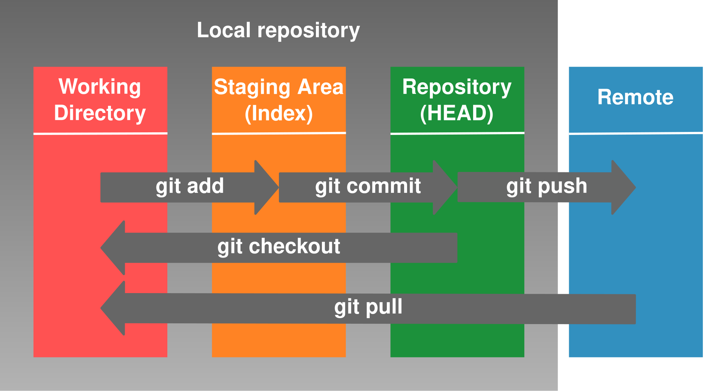
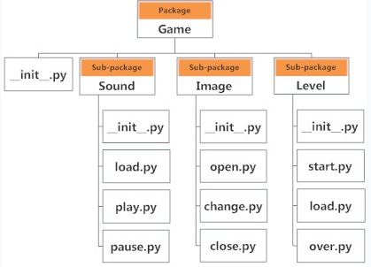
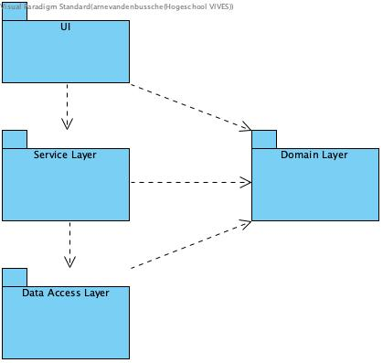

# Build an application in Python

## Introduction

When we build a more complex application in Python, there are a few points of attention.

- Verion control with git: what is the contents of .gitignore?
- The use of a virtual environment with .venv.
- Correct use of packages.
- Avoid to keep sensitive data in your source code and git repository.

## Objectives 

After studying this chapter, you will be able to:

- use git in a simple project;
- set up your .gitignore correctly;
- make and use a virtual Python environment;
- use modules and packages correcty;
- find a solution to avoid keeing sensitive data in your source code.

## Sources

[venv - Creation of virtual environments](https://docs.python.org/3/library/venv.html)

[git](https://git-scm.com/)

## Git and .gitignore

###  Git

Professional system engineers and software developers keep their code in a version management system. There is wide choice of tools, but since Linus Thorvalds developed git, git has become the de facto standard. We will use git as our version management system.

Een version managemeng system is crucial when you collaborate with several software developers, but it is also very imporant when you build an application with only one developer, because it gives you the possibility to return a previous version of your code. It also facilitates sharing your code with others and deploying your code on a server.

The place where you keep your code, is called a repository. It is typical of git, that you have one or more local repositories. This means that your code is on your local computer, in a folder that has a hidden folder `.git`in it. We normally connect the local repository with a "remote repository". That is the repository on the server.

We will not give a full git course here. We assume that you have learned about git in other courses. We restrict ourselves to a summary.

### Create a remote repository

Je can make a remote repo on cloud platforms such as Github, Bitbucket, Gitlab, and so on. We will use Github in this course.

We always have a README.md file in our repository. This a a markdown file that gives information about your application:

- What is the goal of the application?
- Which functionalities have been build?
- How should you run the application:
  - Examples of settings files.
  - If applicable, the structure of your database.

### Clone a remote repository

Je can create a repo locally and then connect it to a remote repository, but when starting a project the simplest way is to create a repository in the cloud platform and then clone it on your computer. Clone the repository means that a local copy of the repository is created:

```
git clone <link to repo>
```

Je will have to provide your user name and password. It is possible that you will have to create a local ssh key or an application password. This is explained in detail on the Github website.

### Staging, commit, push and pull



When you change something to your programming code, you should preserve your change. You will not wait to do this until all functionalities are built. Every time you have finished a small part of your application and you are in a state that does not cause fatal crashes, you will do a commit. That means you will a commit al least once a day, but preferable several times during the day.

You can use Git via the command line, wie a sublime plugin of via Github desktop, a more graphical tool. We will summarize the most important command that you can use in the terminal.

First you will add the file that have been changed tot the _staging phase_.

```
git add <naam bestand>
```

or to all all changes files:

```
git add -A
```

You can query the status of your repo by the command:

```
git status
```

After adding the changed files, you will do a commit. Always add a meaningful message to the commit:

```
git commit -m 'back-end module to add a new product'
```

The last step is to push youyr commits to the remote repository:

```
git push
```

When someone alse will work on the application, or you work on the application on another machine, the local repository will have to be updated with a pull command:  

```
git pull
```

During the development process, you can create several branches, that represent a specific task you are working on. You can later merge them with the main branch. We will not discuss branching and other complex git issues here. You will not need it when you work on a project by yourself.

### .gitignore

Code is the git repository is never forgotten. You can always go back to it. It is therefore essential to make sure you do not add files to your git repository that do not belong there:

- compiled code;
- configuration files that can vary depending on the environment (development, staging, different clients, ...), such as the configuration of your database connection;
- password files;
- the database itself (an example database can be in your git repo).
- ...

The files or folder that must be ignored by git, are put in a text file with the name `.gitignore`. This files will be part of your git repo.

A typical `.gitignore` file for a simple Python project can be found below, with some explanation.

```
# files with compiled code or the folders with compiled code
__pycache__/
*.py[cod]
*$py.class

# C extensions
*.so

# the database itself
dbproject.sqlite3
project.db

# configuration files 
settings.py
.env

# the hidden folder of your virtual environment

.env
.venv
env/
venv/
```


## Create a virtual environment with venv

When we are working on several Python projects at the same time, we don't want your Python installation to be bloated with different versions of Python and a large number of installed modules in different versions. A different version of modules may be needed for different projects. Therefore we will a virtual Python environment per Python project.

There are several modules that can create a virtual environment, such as Virtualenv, but in this course we will stick to venv, the module that is enclosed in a standard Python installation: [venv](https://docs.python.org/3/library/venv.html)

Have a look at the official documentation of venv. We will summarize the most important elements:

- We create a virtual environment in our project folder. To do that we make a hidden folder in our project folder. The folder will contain a Python installation specific for your project. When you install packages, you will install them in your virtual environment, and not system wide. You can call the hidden folder whatever you want, but name such as `.venv` or `.env` are common.
- We activate the virtual environment.
- When we install packages, they are installed in the virtual environment and have no impact on the rest of the system.

Create a virtual environment in a hidden folder `.venv`:

```bash
python -m venv .venv
```

We activate the virtual enviroment. On Mac OS and Linux you will find a hidden folder `bin` with the activation scripts. In Windows there is a subfolder `Scripts`.

Activate the virtual environment on Mac OS or Linux:

```bash
source .venv/bin/activate
```

Activate the virtual environment on Windows, in cmd:

```cmd
.venv/Scripts/activate.bat
```

Activate the virtual environment on Windows, in Powershell:

```powershell
.venv/Scripts/activate.ps1
```

You can see that your virtual environment is active at your command prompt.

We can now install the packages we need for your project, e.g. pandas.

```
pip install pandas
```

These packages are contained to the virtual environment.

To deactivate the virtual environment, we use the command `deactivate`.

To make our application ready for **deployment** on a server or another client machine, we will take the following steps:

- We gather a list of installed packages (and their correct version number) in the file `requirements.txt`.
- We commit our code and `requirements.txt` and push the commit to the remote git repository.
- On the server (or the other client machine) we pull our code from the remote repository into the git repository on our server (or other client machine).
- We fill in the correct values in our settings files.
- We create a virtual environment on our server.
- We install the packages needed based on the contents of the file `requirements.txt`.

So, on our **development machine**:

First gather the installed packages in `requirements.txt`.

```bash
pip freeze > requirements.txt 
```

Commit this file to our local repo and push to the remote repo.

```bash
git add requirements.txt
git commit -m 'add requirements.txt'
git push
```

Then we log in to the **server** where we want to deploy our application. We will first get the latest version of our code:

```bash
git pull
```

Then we create a virtual environment on our server, activate it and install all the packages.

```bash
python -m venv .venv
source .venv/bin/activate
pip install -r requirements.txt
```

### Use a virtual environment in Spyder

When we've created a virtual environment, we want to use the Python runtime of this virtual environment. How can we do that?

- Go to "Preferences" (Windows: Tools menu; Mac: Spyder6 menu).
- Choose "Python interpreter"
- Instead of "internal", choose "Use the following interpreter".
- Choose in the hidden folder where your virtual environment is situated, the folder where you can find Python.exe.
- Test this, by importing a package that is installed within the virtual environment.

## Use packages correctly

Python code is stored in files with the extension.py. Python reads such a file and executes it. We call such a Python file a **script**. The code in a script is meant to be executed directly.

It is also possible to store code in a text file with the extension `.py` that is not meant to be executed directly, but that is called by other code, that is to serve as a library. We call this a **module**. 

Physically there is no difference bewteen a script and a module, because in both cases we have a text file with the extension `.py`. The difference is in the usage. Code in a script can be imported in another piece of code, but that is not the real purpose of a script. A script is executed. A module can be run independently too, but that is not its purpose. A module is usually a collection of classes and functions, that will be imported in other modules or scripts.

A **package** is a collection of modules. Physically it is just a folder with `py` files, with modules. A package folder must contain a file `__init__.py`. This file is usually empty, but it can contain code that must be executed the moment the package is imported. The `__init__.py` is not really required. Folders with a `__init__.py` are called regular packages. Packages without it are called namespace packages.

A package can have **subpackages**, as you can see in the image below. Game has three subpackages: Sound, Image and Level. The subpackage Sound has three modules: load, play and pause; the subpackage Image contains the modules open, change and close; the subpackage Level contains the modules start, load and over. Sound and Level have a module load, but this is no problem, as they reside in a separate subpackage. The is no name conflict. This example illustrates how packages and modules can be used to structure your code.



**External modules** are installed with the command `pip install <module name>`. You can import the module as follows:

```python
import numpy as np
```

We have already covered this in the chapter about functions. You can give a module an alias.

You can also import individual functions.

```python
from math import sqrt as square_root
```

You can **develop your own modules**. These will contains classes and functions that can be used in other modules. In the Python file of this module, you will make a distinction between classes and functions that can be used by others, and code that is only executed when you execute this file as an independent script. This code, that is not executed at the moment of an import, will be put under the followind `if` statement:

```python
if __name__ == '__main__':
```

If your own module is in the same folder as the script in which you want to use the module, calling the module is simple: you import the module with the name of the Python file without the extension `py`.

```python
import my_module # Python file has the name my_module.py
```

You can get a list of functions and classes in a module with the command `dir(<name of the module)`.

You can also **make your own packages**. A package is a folder containing Python files. You can, for compatibility with older versions of Python, put an empty file `__init.py__' in that folder. A typical project will contain a number of subfolders with Python files. We want to make our code as modular as possible, according to the Single Responsibility Principle, that states that a class must focus on one or a limited number of closely related tasks. The same principle holds for modules.

Up to now importing a module was easy. If the module is in the same folder, you just use the name of the Python file containing the module, withouth the extension `py`. If your projet is organized in several folders, things are more complex. Where will Python look for the module the moment you do an import?

* In the current folder of the script.
* In the list of folders defined in the environment variable PYTHONPATH.
* In the list of folders that are defined at the installation of Python. In a virtual environment created by venv, Python will try to find them in the virtual environment. 

The folders where Python will look are defined in the variable `sys.path`.

```python
import sys
sys.path
```

All the folders mentioned above are added to `sys.path`. There are options: your module in the current folder, you define the environment variable PYTHONPATH, or you change `sys.path` at runtime to add a specific folder.

```python
import sys, os
sys.path.append(os.path.dirname((__file__))
```

You can get the actual location of a module via the attribute `__file__', the corrent location of the file executed.

Explicitely adding the current path to `sys.path` is usually not necessary when the scripts that start the whole application is in the main folder of your project. That folder will automatically be added to `sys.path` the moment you start the script.

```python
>>> import math
>>> math.__file__
'/Library/Frameworks/Python.framework/Versions/3.11/lib/python3.11/lib-dynload/math.cpython-311-darwin.so'
```

Let us take the example we used above.


How will your import the different packages and modules in the other modules in this application? Folders have a hiërarchical structure. The folder "Game" is addes to `sys.path`. To call the underlying packages, we use the dot-notation. In the dot-notation we separate subfolders and modules by a dot.

```python
import Game.Image.open
from Level import start, load, over
```

You can import a packages, but that is not very usefull. It is better to go to the level of a module, class or function.

Relative import is also possible. That will not start at the top of the hierarchy, but from the current module. In `Game.Sound.pause.py` you could use the followig statement: 

```python
import ..Image.open
```

The two dots refer to the folder one position higher in the folder hierarchy.

The file `__init__.py` can remain empty, but it could contain code that is executed when a package is imported, initialisation code so to say. The file `__init__.py` is executed automatically at import. An example of this is the automatic import of other packages. 

## Keeping sensitive data

In your Python application you somethimes need data:

- that are sensitive such as passwords;
- that are different on your development computer in comparison to the server, such as connections to the database, email adresses, and so on.

It is not a good idea to store these elements in your code and commit them to the git-repository.

How do we deal with these data?

Een simple way is to store this information in a `setting.py` file and import that file in the places where you need the data. This is a viable option for connection data or other configuration data. You add the file `settings.py` to `.gitignore` and explain in your README.md file where to store this file and fill it with data in the correct format. Je can add an example file `example_settings.py` so that other developer get an idea what an actual `setting.py` look like. This road of action gives you the possibility to provide a different settings file for you local development computer, for your test server and for your actual production server. This method is simple but not very suitable for passwords.

A second option is to keep certain values in **environment variables**. The environment variables get another value on your local development machine, on the test server and on the production server. To read the values of environment variable you can use the object `os.environ`. This object is a dictionary that contains the values of the environment variables. When we want to read the value of the environment variable 'HOME', our code will look like this:

```python
import os
my_home_folder = os.environ['HOME']
```

You can define and set your own environment variables for different settings such as your database connection.

A similar approach is to store sensitive data in a hidden file `.env` that is not committed to your git repo. There are modules that can easily read a file like that.


```python
from environs import Env # https://pypi.org/project/environs/

env = Env()
env.read_env() # read .env file if it exists

db_host = env.str("DB_HOST")
db_database = env.str("DB_DATABASE")
db_port = env.int("DB_PORT")
production = env.str("PRODUCTION")

user_home = env("HOME")
```

These solutions are safer than keeping passwords in your code, but you can still make this safer by storing the password in a "vault", a safe place where passwords are encrypted and that you can query via code. There are a lot of solution, commercial as well as open-sourece. Infisical in an example of an open-source platform.

## How to structure your code?

In any project, it’s important to give your code a good structure using packages (subdirectories) and modules (files). This offers several advantages:

- **Clarity**: when you need to debug or extend your code months later, it’s essential to quickly see where specific components are located.
- **Reusability**: by splitting your code into small, focused units, you can reuse these units in different parts of the same project — or even across projects — while avoiding code duplication.
- **Testability**: small units are easier to test, for example using unit tests.
- **Maintainability**: when your project has a clear structure made up of smaller units, it becomes easier to extend the code or replace specific parts (for example, the UI or the database).

We follow some general guidelines for this:

- The project starts from a single file called main.py, located in the root directory.
- **UI Layer** – The user interface is separated from the rest of the code. Everything related to input and output is placed in a separate module or package. These parts perform basic validation of the input, but contain little or no business logic. This separation makes it possible to later change the UI — for example, from a command-line application to a desktop or web application.
- **Data Access Layer** – Database access is organized in a separate package, isolated from the rest of the project. This makes it easy to change how data is stored or retrieved. For instance, you could start with text files and later switch to a relational database. It also ensures that all SQL statements are kept together rather than scattered across the codebase. We call this the Data Access Layer.
- **Domain Layer** – Here we define the classes that represent the core concepts of the application — the domain objects. Think of classes such as Customer, Appointment, Product, or Order. These are often simple classes, for example implemented as data classes.
- **Service Layer** – More complex business logic, or code that prepares data for output or for storage, belongs in a separate service layer.

By modularizing in this way, we reduce dependencies between modules.

- The UI depends on (i.e., makes use of) the Service Layer and the Domain Layer.
- The Service Layer depends on the Data Access Layer and the Domain Layer.
- The Data Access Layer depends only on the Domain Layer.

This means that if we make changes to the UI, no other layer is affected. In the other layers, we try to hide concrete implementation details as much as possible — for example, which database we use, or whether we work with SQL directly or an ORM framework.

Changes in the domain models (in the Domain Layer) will, however, affect all layers. That’s why a good functional analysis and data analysis are essential.

The dependencies are shown clearly in the diagram below:



If your main module is in the root directory of your project, the simplest way to run your project is run main from the root.

```bash
python main.py
```

However, in larger projects, it is possible that you `main.py` is in a package, e.g. the package `cli_layer`. In that case you'd have to run is a a module:

```bash
python -m cli_package.main
```

This way, you can be sure that all import will be executed correctly.
