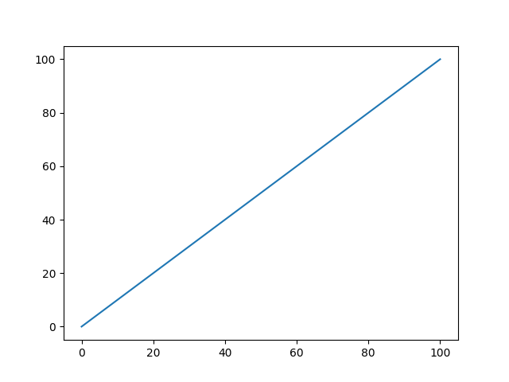
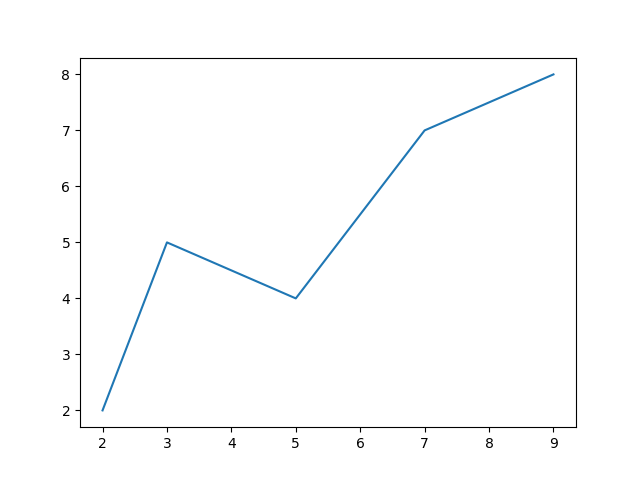
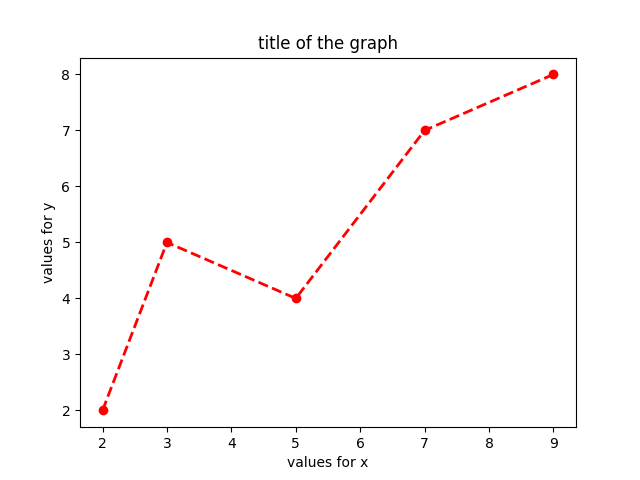
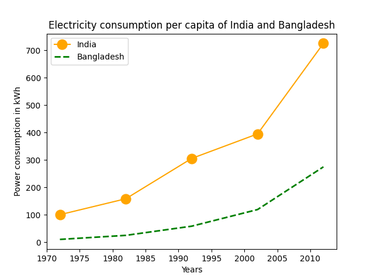
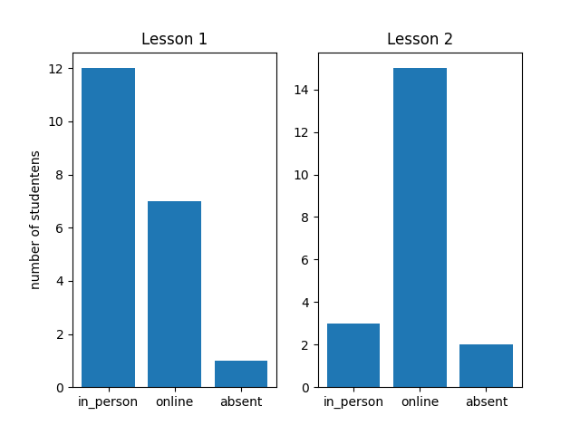

# Manipulate and visualize number with NumPy and Plot

## Objective

After this chapter you can:

- make Numpy arrays in different ways: by giving a list, with random number, with ones, with zeros;
- select and filter items with slicing and indexing
- query the shape, dimension and size;
- go through a vector or matrix, transpose and resize a matrix, sort a vector, flatten a matrix, combines vector and matrices;
- modify a vector or matrix;
- apply elementary aggregations and stasticial functions to vector and matrices;
- make a simple graph (line, scatter, column, pie) based on NumPy arrays. You can add titles and labels and change the color and the appearance of your plot.

## Sources

[Numpy's website](https://numpy.org/)

[Beginner's guide to Numpy](https://numpy.org/doc/stable/user/absolute_beginners.html)

[mathematical functions of NumPy](https://numpy.org/doc/stable/reference/routines.math.html)

[staticial functions of NumPy](https://numpy.org/doc/stable/reference/routines.statistics.html)

[Matplotlib](https://matplotlib.org/)

[Overview of plots you can draw with Matplotlib](https://matplotlib.org/stable/gallery/index.html)

## What is NumPy?

Up to now we only worked with modules that were built in Python. The true power of Python shows itself when we use external modules that can execute specific action very simply of very efficiently. In some case those external modules are programmes in the C programming language and are therefore very fast.

One such module is NumPy. The NumPy package is built to perform scientific calculations quickly and flexibly. It provides modules for matrices and other multidimensional arrays and provides functions to quickly sort, modify, filter numbers and do mathematical and statistical calculations.

We will not explore all aspects of NumPy. What we aim for is an introduction to NumPy so that the threshold is removed for those who have a need for this package and want to explore it further.


## Install and import Numpy

As usual, installing Numpy is done with the `pip` package.

```bash
pip install numpy
```

It is possible you have to use `pip3`.

When we install a package, we prefer to create a virtual enviroment first.

```bash
# create a virtual environment in the folder .venv
python -m venv .venv

# activate the virtual enviroment in linux or mac
source .venv/bin/activate

# activate the virtual environment in Windows via a bat file
# .venv/Scripts/activate.bat

# activate the virtual environment in  Windows via Powershell
# .venv/Scripts/Activate.ps1

# install numpy in your virtual environment
pip install numpy
```

Before we can use the function of NumPy, we import the module in our code. We can choose any alias, but the convention is to use `np`.

```python
import numpy as np
```

## NumPy array

We know a list in Python. A list can contain dissimilar objects. A NumPy array is similar to a list, except that all objects in the list are of the same type. This allows efficient processing of the array. This type of array also takes up less memory space.

A NumPy array can consist of one or several dimensions. We reach values of an array via an index. This can be a positive integer, a boolean or another array. We demonstrate this using a number of examples.

In the example below, we create a two-dimensional array, also called an matrix, and print the first element. By default, the index is an integer, starting at 0. We call a one-dimensional array a vector.

```python
a = np.array([[1, 2, 3, 4], [5, 6, 7, 8], [9, 10, 11, 12]])
print(a[0]) #  [1 2 3 4]
print(a[1][2]) # 7
print(a[1,2]) # 7
print(a[2,3]) # 12
print(a[3,3]) # IndexError: index 3 is out of bounds for axis 0 with size 3
```

In the example above, you can see how an array is created using the command `np.array`, that has a list as its argument.

When you want to fill up an array with a list of number, you can do this easily with a number of basic commands:

```python
zero_row = np.zeros(5) # an array with five zero: array([0. , 0., 0., 0., 0.])
one_row = np.ones(6) # an array with six ones: array([1., 1., 1., 1., 1., 1.])
random_row = np.empty(3) # an array with three random elementes: array(3., 2., 1.)
```

There are several ways to create an numpy array with structured elements. One often used is `np.arange([start,] stop[, step])`

```python
row1 = np.arange(5) # [0 1 2 3 4]
row2 = np.arange(6,10) # [6 7 8 9] # begin at six, end at 10 (10 not included)
row3 = np.arange(0, 11, 2) # [0, 2, 4, 6, 8, 10] # begin at 0, end at 11, step 2
```

Arrays are homogenuous. You can ask for the data type of the elements, with `dtype`.

```python
my_row= np.arange(10)
print(my_row.dtype) # int64
random_row = np.empty(3)
print(random_row.dtype) # float64
statements = np.array([False, True, True, False])
print(statements.dtype) # bool
```

## Slicing and indexing

A Numpy array behaves like a List when we use slicing. Let's illustrate this.

```python
row = np.arange(10) # [0 1 2 3 4 5 6 7 8 9]
print(row[2:5]) # [2 3 4] from the second tot the fifth element, boundaries not included
print(row[3:]) # [3 4 5 6 7 8 9] fomr the thirdt to the end (third not included)
print(row[:3]) # [0 1 2] from to beginning up to index 3 
print(row[-3:]) # [7 8 9] the three last elements
print(row[:-3]) # [0 1 2 3 4 5 6] all the elements from the beginning, except the three last ones
```

Instead of slicing, you can also select elements based on a condition. We call that indexing.

```python
print(row[row % 2 == 0]) # [0 2 4 6 8] all even elements
print(row[row > 5]) # [6 7 8 9] all elements larger than 5
print(row[(row % 2 ==  0) & (row > 5)]) # [6 8] all even elements larger than 5
```

Instead of a condition, you can also define an array of booleans.

```python
v = np.array([100, 200, 300, 400])
select = [False, True, True, False]  # select 2nd en 3rd element
print(v[select]) # [200, 300]

```

If you want to get all the unique values of a vector you use the function `unique`

```python
a = np.array([11, 11, 12, 13, 14, 15, 16, 17, 12, 13, 11, 14, 18, 19, 20])
print(np.unique(a)) # [11 12 13 14 15 16 17 18 19 20]
```

## Shape, size and dimensie

We can ask for meta-data of an array: the shape, the size and the dimension.

* dimension: is one for a vector, two for a matrix (`numpy.ndarray.ndim`)
* size: the total number of elements in the array. For a two-dimensional array, this is the product of the columns and the row (`numpy.ndarray.size`).
* shape: the number of elements in each dimension (`numpy.ndarray.shape`). A matrix of two rows and three columns will have a shape of (2, 3)`.

Voorbeelden zullen dit illustreren:

```python
my_vector = np.arange(10) # [0 1 2 3 4 5 6 7 8 9]
print(my_vector.ndim, my_vector.size, my_vector.shape) # 1 10 (10,)
my_matrix = np.array([[1, 2, 3], [4, 5, 6]])
print(my_matrix.ndim, my_matrix.size, my_matrix.shape) # 2 6 (2, 3)
```

An example of the use of shape is when you want to create an array with random values. With the function `random()` and `randint()`, we can quickly create matrices with random numbers. These function belong to the module `numpy.random`. The argument is a shape, a tuple of the number of rows and columns.

```python
random_array = np.random.rand(4, 2) 
# [[0.32513627, 0.83181569],
# [0.83691663, 0.05733525],
# [0.63533219, 0.58083827],
# [0.68097897, 0.71657645]]
random_int  = np.random.randint(low=1, high=10, size=(2,4))
# [[7, 8, 4, 4], [1, 6, 6, 6]]
```

## Step through Numpy arrays, sort them, modify them

Stepping through a numpy array can be done with a for loop.

```python
m = np.array([['a', 'b', 'c'], ['d', 'e', 'f']])
for row in m:
  for element in row:
    print(element, end=" ")
# a b c d e f 
```

An alernatiive is the function `nditer()`

```python
for element in np.nditer(m):
  print(element, end=" ")
# a b c d e f 
```

**Sorting** is done the the function `sort()`. The array is modified in the sort.

```python
r = np.random.rand(2, 3) 
# [0.58020338 0.78299494 0.12514963] [0.51775737 0.59424713 0.38421092]]
r.sort() # per row, axis=1
# [[0.12514963 0.58020338 0.78299494] [0.38421092 0.51775737 0.59424713]]
r.sort(axis=0)
# [[0.12514963 0.51775737 0.59424713] [0.38421092 0.58020338 0.78299494]]
```

**Reversing** an array is done with `flip()`.

```python
r = np.array([3, 1, 2])
r.sort()
r = np.flip(r)
print(r) # [3 2 1]
```

You can **combine** arrays with `concatenate((x1, x2), axis=0)`

```python
a = np.array([1, 2, 3, 4])
b = np.array([5, 6, 7, 8])
np.concatenate((a, b)) # [1, 2, 3, 4, 5, 6, 7, 8])
x = np.array([[1, 2], [3, 4]])
```

You can apply **arithmatic operations** on a vector without using a loop. This is not only more readable, but a lot faster. We spreak about a **vectorized expression**.

```python
a1 = np.array([2, 6, 5])
a3 = a1 * 10 # [20 60 50] all elements multiplied by 10
a5 = a1 + 5 # [ 7 11 10] add 5 to all elementes
```

You can **reorder** a matrix with `reshape()` and `transpose()`.

With transpose we swap the dimensions: rows become columns and columns rows.

```python
a = np.array([[1, 2, 3, 4], [5, 6, 7, 8], [9, 10, 11, 12]])
b = a.transpose()
print(b)
```

Output:

```bash
[[ 1  5  9]
 [ 2  6 10]
 [ 3  7 11]
 [ 4  8 12]]
```

With reshape you change the shape, but the elements remain in the same order:

```python
c = a.reshape(4,3)
print(c)
```

Output:

```bash
[[ 1  2  3]
 [ 4  5  6]
 [ 7  8  9]
 [10 11 12]]
```

You can transform a matrix to a vector (**flatten**) with the function `flatten()`.

```python
d = a.flatten()
print(d)
```

Output:

```bash
[ 1  2  3  4  5  6  7  8  9 10 11 12]
```

We have not covered all numpy functions. You can find the rest in the documentation.

## Shallow versus deep copy

When we modify a vector or matrix, we must know what we are doing. Most of the times we do not really modify the numpy array. We create a view and the variable is a reference to that view. The original array is unchanged. Slicing is an example of that. This is what we call a shallow copy.

```python
a = np.array([[1, 2, 3, 4], [5, 6, 7, 8], [9, 10, 11, 12]])
b1 = a[0,1:]
print(b1) # [2 3 4]
b1[0] = 99
print(b1) # [99  3  4]
print(a)
```

Output:

```python
[[ 1 99  3  4]
 [ 5  6  7  8]
 [ 9 10 11 12]]
```

If you want to make a full copy, with no reference to the original array, we use the function `copy()`.

```python
b2 = a.copy()
b2[0,0] = 100
print(b2)
```

Output:

```bash
[[100  99   3   4]
 [  5   6   7   8]
 [  9  10  11  12]]
```

```python
print(a)
```

Output:

```bash
[[ 1 99  3  4]
 [ 5  6  7  8]
 [ 9 10 11 12]]
```

This is what we call a deep copy.

## Aggregations and statistical functions in NumPy Arrays

The power of NumPy arrays is that you can calculate aggregate values quickly. A few examples:

* Sum: sum of all elements `sum(a)`
* Add: add the elements of two arrays, element per element, `add(x1, x2)`.
* Minimum: `min(a)`
* Maximum: `max(a)`
* Average: `mean(a)`
* Round: `round(a)`
* Product: the product of all elements `prod()`
* Multiply: multiply all elements, element per element `multiply(x1, x2)`
* Median: `median(a)`

The number is mathematical and staticial function in NumPy is mind-blowing.

Examples:

```python
tbl = np.array([[1, 2, 3], [4, 5, 6]])
print('sum:', tbl.sum()) # 21
print('min:', tbl.min()) # 1
print('max:', tbl.max()) # 6
print('mean:', tbl.mean()) # 3.5

a1 = np.array([2, 6, 5])
a2 = np.array([3, 2, 8])
added = np.add(a1, a2)
print(added) # [ 5  8 13]
mutiplied = np.multiply(a1, a2)
print(multiplied) # [ 6 12 40]
```

## Matplotlib

MMatplotlib is a module for visualising data. Whereas with NumPy you have an enormously powerful tool for analysing data, with Matplotlib you seem to have an infinite range of possibilities for visualising data. Think of a graph and you can draw it with matplotlib.

We will limit ourselves to a few basic graphs.

## Installing and importing matplotlib

As usual, installation is straightforward with `pip`. Most of the functions we need are in the `pyplot` submodule. So we are only going to import these. Traditionally, we then call these `plt`.


```python
import numpy as np
import matplotlib.pyplot as plt
```

## Make a simple line plot

Let's begin with a simple line plot that shows the values from 1 to 100. You start from a vector. With `plot()` you make a plot, and you display the plot with `show()`.

```python
import numpy as np
import matplotlib.pyplot as plt

y = np.arange(101)
plt.plot(y)
plt.show()
```



An alternative is to have two vectors, one with the x values and one with the y values.

```python
x = [2, 3, 5, 7 , 9]
y = [2, 5, 4, 7, 8]
plt.plot(x, y)
plt.show()
```




## Decorate the line plot

In the graph below, we will change the colour, label the x-axis, label the y-axis and adjust the title.

You can change the **colours** via a letter code (‘k’ is black, for example). You can also scale the colours in full (black, blue, red, green, yellow, cyan, magenta, ...) or you can specify an RGB value. An rgb value consists of three numbers. We specify the colour in the plot function. The name of the argument is ‘colour’.

The **line type** is the argument ‘linestyle’. This can be ‘:’ for a dotted line, ‘-’ for a solid line, ‘--’ for a dashed line and ‘-.’ for a dashed line.

You can also specify a **marker**. With this you specify whether the values will also have a point (‘o’), a square (‘s’ for square) or nothing at all.

You can adjust the **line width** with the argument linewidth.

Let's recreate the previous graph, but with dots, a dotted line, colour red and a slightly thicker line. We also provide labels and a title.

```python
x = [2, 3, 5, 7 , 9]
y = [2, 5, 4, 7, 8]
plt.plot(x, y, color='red', linewidth='2', linestyle='--', marker='o')
plt.xlabel("values for x")
plt.ylabel("values for y")
plt.title("title of the graph")
plt.show()
```



You can plot several lines in one plot and add a legend.

```python
import matplotlib.pyplot as plt
 
year = [1972, 1982, 1992, 2002, 2012]
e_india = [100.6, 158.61, 305.54, 
           394.96, 724.79]
 
e_bangladesh = [10.5, 25.21, 58.65,
                119.27, 274.87]
 
plt.plot(year, e_india, color ='orange',
         marker ='o', markersize = 12, 
         label ='India')
 
plt.plot(year, e_bangladesh, color ='g',
         linestyle ='dashed', linewidth = 2,
         label ='Bangladesh')
 
plt.xlabel('Years')
plt.ylabel('Power consumption in kWh')
 
plt.title('Electricity consumption per \
capita of India and Bangladesh')
 
plt.legend()
plt.show()
```



## Subplots

Here you will find an example of several subplots in one figure. This is an example of a bar plot.

```python
categories = ['in_person', 'online', 'absent']  # presence during lessons
number_of_students_lesson1 = [12, 7, 1]  # number of students per categorie for lesson 1
number_of_students_lesson2 = [3, 15, 2]  # number of students per categorie for lesson 2

# We create two subplots, in one row and two columns
plt.subplot(1, 2, 1) 
plt.bar(categories, number_of_students_lesson1)
plt.ylabel('number of studentens') 
plt.title('Lesson 1') 

plt.subplot(1, 2, 2)
plt.bar(categories, number_of_students_lesson2)
plt.title('Lesson 2') 

plt.show()
```



The function `subplot()` has the number of rows as the first argument. The second argument is the number of columns. The third argument is the number of the subplot you want to draw. This means `subplot(1, 2, 2)` has one row and two columns, and this is the second plot.

## Plot types

As we mentioned, the number of plot types in PyPlot is enormous. We mention some:

- Line plot: `plt.plt`. We provide the value for the x-axis and the y-axis.
- Scatter plot: `plt.scatter()`. We will have at least a x value and a y value.
- Bar plot: `plt.bar()`. Two arguments: categorie and height.
- Pie plot: `plt.pie()`. We pass a vector with values. We can also pass a vector of labels, or one of colors.
- Horizontal bar plot: `plt.barh()`.

