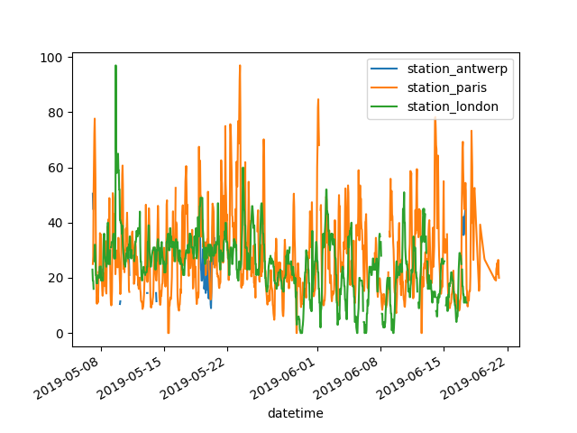
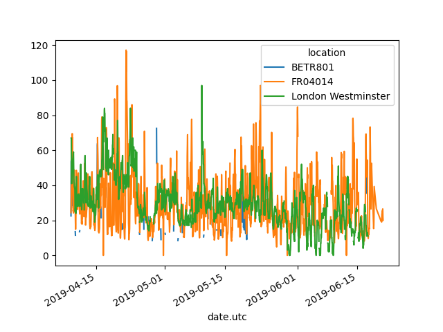

# Data analysis with Pandas

## Learning objectives

After this chapter you will be able to:

* make a dataframe based on an existing list or dictionary
* make a series
* explore data in a dataframe
* convert date in a dataframe (string operations, datatype conversion)
* change column names in a dataframe
* remove columns from a dataframe
* add columns to a dataframe
* filter data on columns, row, conditions, indexes and slicing
* perform a statistical analysis on data in a datafrme, with or without grouping
* read data from a csv file, an Excel file, a json file or an sqlite3 database into a dataframe
* write data from a dataframe to a csv file, an Excel file or a json file
* visualize data from a dataframe in a line plot, a scatter plot, a bar plot or a pie plot.

## Sources

[The official pandas site](https://pandas.pydata.org/)

## What is Pandas?

Pandas is a Python library especially suited to writing and analyzing large amounts of data. When you have a collection of ten thousands of data, Excel might not be the right tool foor you. Pandas makes processing these data easy. 

You install Pandas via `pip`. Do not forget to create a virtual environment.

```bash
python -m venv .env
source .env/bin/activate # Windows: .env/Scripts/activate.bat
pip install pandas
```

We will import Pandas into our Python script.

```python
import pandas as pd # we give Pandas the alias pd by convention
```

# Data structures in Pandas

The two bacic data structures in Pandas are: `Series` and `DataFrame`.

`Series` is one-dimensional (one column), a `DataFrame` is two-dimensional (table with rows and columns). Pandas has been developed on top of NumPy and is therfore very efficient as to calcuting power. Both data types can contain all types of objects. By default the indices are numbers as in lists, but we can also pass our own index, in the form of a list of labels. It is self-evident that the index list must have the same lenght as the values list.

```python
import pandas as pd
import numpy as np

rij = pd.Series(np.random.randn(5))
print(rij)
```

Output:

```
0    0.309326
1   -0.394174
2    1.722596
3   -0.644675
4   -1.048602
dtype: float64
```

Example with our own list of indices:

```python
s = pd.Series(np.random.randn(5), index=["a", "b", "c", "d", "e"])
print(s)
```

Output:

```bash
a   -0.179841
b    0.474589
c    0.304474
d    0.667548
e   -0.996806
dtype: float64
```

We can also create a `Series` object from a dict. The keys are the indices.

```python
d = {"b": 1, "a": 0, "c": 2}
print(pd.Series(d))
```

Output:

```text
b    1
a    0
c    2
dtype: int64
```

A `DataFrame` is two-dimensional and consists of columns and column headers. You can create a `DataFrame` from elements of type `Series`, a NumPy array,  another `DataFrame` or a dict. Let's illustrate this with a few examples:

```python
import pandas as pd

# Make a DataFrame from  'dictionary of lists'.
my_data_frame = pd.DataFrame({
    "Name": ["Pol", "Romeo", "Thomas", "An"],
    "Age": [25, 65, 63, 21],
    "Sex": ["male", "male", "male", "female"]
})

# Dump the DataFrame. 
# Note that the keys of the dicationary are used as column names, the values from the lists as column data.
print(my_data_frame)
```

Output:

```text
     Name  Age     Sex
0     Pol   25    male
1   Romeo   65    male
2  Thomas   63    male
3      An   21  female
```

## Query data from a Series or DataFrame

Each column in a DataFrame is a Series. You can query these separately. Let's take the example above:

```python
print(my_data_frame["Age"])
```

Output:

```text
0    25
1    65
2    63
3    21
```

If you want to query one element, you can use the index: `my_data_frame["Age"][0]`. This will give the value 25.

## Get data from and write data to different data sources 

### CSV and Excel

Pandas is not only strong in quick statistical analysis, but you can query sources from different data sources very easily. In the example below we create a DataFrame by reading a csv file `titanic.csv`.

```python
titanic_data_frame = pd.read_csv("titanic.csv")
```

Pandas will create a DataFrame and try to convert all data to the correct data type. Now we can for examples query the first ten elements: 

```python
titanic_data_frame.head(10)
```

```text
PassengerId  Survived  Pclass  ...     Fare Cabin  Embarked
0            1         0       3  ...   7.2500   NaN         S
1            2         1       1  ...  71.2833   C85         C
2            3         1       3  ...   7.9250   NaN         S
3            4         1       1  ...  53.1000  C123         S
4            5         0       3  ...   8.0500   NaN         S
5            6         0       3  ...   8.4583   NaN         Q
6            7         0       1  ...  51.8625   E46         S
7            8         0       3  ...  21.0750   NaN         S
8            9         1       3  ...  11.1333   NaN         S
9           10         1       2  ...  30.0708   NaN         C
```

You can also write a DataFrame to a csv file.

```python
df = pd.DataFrame({"brand": ["Mercedes", "BMW", "Audi"], 
                   "color": ["white", "black", "blue"]})
df.to_csv("cars.csv", sep=",", index=False)  # default separator is ','
```

By using `index=False`, you avoid that the row number too are added to the csv file.

You can also write a DataFrame to an Excel file, by using the `to_excel()` method. Similarly, there are other `to_*` methods, such as `to_html()`, `to_json()`, `to_sql()`, ...

```python
titanic_data_frame.to_excel("myTitanicExcelFile.xlsx", sheet_name="passengerlist", index=False)
```

It is possible that you get the error "No modules name 'openpyxl'". In this case you install the module with `pip install openpyxl`.

The opposite is also easy, reading an Excel file into a DataFrame.

```python
titanic_data_frame_from_excel = pd.read_excel("myTitanicExcelFile.xlsx", sheet_name="passengerlist")
```

If you get the erros "Missing optional dependency 'xlrd'", install the module with `pip install xlrd`.

Once you've created a DataFrame, it is time to research the data in the DataFrame. You can query 'technical' info about your DataFrame by using the `info()` method.

```python
titanic_data_frame.info()
```

```text
<class 'pandas.core.frame.DataFrame'>
RangeIndex: 891 entries, 0 to 890
Data columns (total 12 columns):
 #   Column       Non-Null Count  Dtype  
---  ------       --------------  -----  
 0   PassengerId  891 non-null    int64  
 1   Survived     891 non-null    int64  
 2   Pclass       891 non-null    int64  
 3   Name         891 non-null    object 
 4   Sex          891 non-null    object 
 5   Age          714 non-null    float64
 6   SibSp        891 non-null    int64  
 7   Parch        891 non-null    int64  
 8   Ticket       891 non-null    object 
 9   Fare         891 non-null    float64
 10  Cabin        204 non-null    object 
 11  Embarked     889 non-null    object 
dtypes: float64(2), int64(5), object(5)
memory usage: 83.7+ KB
```

### Json

```python
import pandas as pd
import matplotlib.pyplot as plt
import json

# JSON-bestand importeren.
co2_values = pd.read_json("co2.json", type='series')
```

### Database

```python
import sqlite3
from sqlite3 import Error
import pandas as pd

try:
  conn = sqlite3.connect("chinook.db")
except Error as e:
  print(e)

sql_query = """
SELECT Title, Name
FROM albums
INNER JOIN artists ON artists.ArtistID = albums.ArtistID
"""

albums = pd.read_sql_query(sql_query, conn)
albums.head()
conn.close()
```

| Title | Name                                  |           |
| ----- | ------------------------------------- | --------- |
| 0     | For Those About To Rock We Salute You | AC/DC     |
| 1     | Balls to the Wall                     | Accept    |
| 2     | Restless and Wild                     | Accept    |
| 3     | Let There Be Rock                     | AC/DC     |
| 4     | Big Ones                              | Aerosmith |

## Select a subset from a DataFrame

If you want to select several **columns** from a DataFrame, use double square brackets. The inner square brackets are a Python list with columns headers indication which columns you want to get. The outer square brackets indicate you want to make a selection from your DataFrame.

```python
import pandas as pd

titanic_data_frame = pd.read_csv("titanic.csv")

age_and_sex = titanic_data_frame[["Age", "Sex"]]
print(age_and_sex)
```

```text
	Age	Sex
0	22.0	male
1	38.0	female
2	26.0	female
3	35.0	female
4	35.0	male
...	...	...
886	27.0	male
887	19.0	female
888	NaN	female
889	26.0	male
890	32.0	male
891 rows × 2 columns
```

Of you want to select several **rows** from a DataFrame, you use a condition in the square brackets. In the folowing example we will select the persons older than 30 from the Titanic passenger list.

```python
older_than_39 = titanic_data_frame[titanic_data_frame["Age"] > 39]
print(older_than_39)
```

```text
     PassengerId  Survived  Pclass                                               Name     Sex   Age  SibSp  Parch      Ticket     Fare Cabin Embarked
6              7         0       1                            McCarthy, Mr. Timothy J    male  54.0      0      0       17463  51.8625   E46        S
11            12         1       1                           Bonnell, Miss. Elizabeth  female  58.0      0      0      113783  26.5500  C103        S
15            16         1       2                   Hewlett, Mrs. (Mary D Kingcome)   female  55.0      0      0      248706  16.0000   NaN        S
30            31         0       1                           Uruchurtu, Don. Manuel E    male  40.0      0      0    PC 17601  27.7208   NaN        C
33            34         0       2                              Wheadon, Mr. Edward H    male  66.0      0      0  C.A. 24579  10.5000   NaN        S
..           ...       ...     ...                                                ...     ...   ...    ...    ...         ...      ...   ...      ...
862          863         1       1  Swift, Mrs. Frederick Joel (Margaret Welles Ba...  female  48.0      0      0       17466  25.9292   D17        S
865          866         1       2                           Bystrom, Mrs. (Karolina)  female  42.0      0      0      236852  13.0000   NaN        S
871          872         1       1   Beckwith, Mrs. Richard Leonard (Sallie Monypeny)  female  47.0      1      1       11751  52.5542   D35        S
873          874         0       3                        Vander Cruyssen, Mr. Victor    male  47.0      0      0      345765   9.0000   NaN        S
879          880         1       1      Potter, Mrs. Thomas Jr (Lily Alexenia Wilson)  female  56.0      0      1       11767  83.1583   C50        C

[163 rows x 12 columns]

```

This works because the condition `titanic_data_frame["Age"] > 39` return a  `Series` of `bool`. This `Series` is used to filter the original DataFrame.

```python
age_filter = titanic_data_frame["Age"] > 39
print(age_filter)
```

```text
0      False
1      False
2      False
3      False
4      False
       ...  
886    False
887    False
888    False
889    False
890    False
Name: Age, Length: 891, dtype: bool
```

Filter on Travel Class can be done by using the `isin()` method. You can for instance filter on the passengers that travel in first and second class, by passing a list like object to the method.

```python
class_one_and_two_passengers = titanic_data_frame[titanic_data_frame["Pclass"].isin([1,2])]
print(class_one_and_two_passengers)
```

```text
     PassengerId  Survived  Pclass  ...     Fare Cabin  Embarked
1              2         1       1  ...  71.2833   C85         C
3              4         1       1  ...  53.1000  C123         S
6              7         0       1  ...  51.8625   E46         S
9             10         1       2  ...  30.0708   NaN         C
11            12         1       1  ...  26.5500  C103         S
..           ...       ...     ...  ...      ...   ...       ...
880          881         1       2  ...  26.0000   NaN         S
883          884         0       2  ...  10.5000   NaN         S
886          887         0       2  ...  13.0000   NaN         S
887          888         1       1  ...  30.0000   B42         S
889          890         1       1  ...  30.0000  C148         C

[400 rows x 12 columns]

```

Some passengers have an unkown age. If you want to restrict operations to passenger that have an age, you can use the method `notna()`. This will return True when a not null value is found.

```python
passengers_with_age = titanic_data_frame[titanic_data_frame["Age"].notna()]
print(passengers_with_age)
```

```text
     PassengerId  Survived  Pclass                                               Name     Sex   Age  SibSp  Parch            Ticket     Fare Cabin Embarked
0              1         0       3                            Braund, Mr. Owen Harris    male  22.0      1      0         A/5 21171   7.2500   NaN        S
1              2         1       1  Cumings, Mrs. John Bradley (Florence Briggs Th...  female  38.0      1      0          PC 17599  71.2833   C85        C
2              3         1       3                             Heikkinen, Miss. Laina  female  26.0      0      0  STON/O2. 3101282   7.9250   NaN        S
3              4         1       1       Futrelle, Mrs. Jacques Heath (Lily May Peel)  female  35.0      1      0            113803  53.1000  C123        S
4              5         0       3                           Allen, Mr. William Henry    male  35.0      0      0            373450   8.0500   NaN        S
..           ...       ...     ...                                                ...     ...   ...    ...    ...               ...      ...   ...      ...
885          886         0       3               Rice, Mrs. William (Margaret Norton)  female  39.0      0      5            382652  29.1250   NaN        Q
886          887         0       2                              Montvila, Rev. Juozas    male  27.0      0      0            211536  13.0000   NaN        S
887          888         1       1                       Graham, Miss. Margaret Edith  female  19.0      0      0            112053  30.0000   B42        S
889          890         1       1                              Behr, Mr. Karl Howell    male  26.0      0      0            111369  30.0000  C148        C
890          891         0       3                                Dooley, Mr. Patrick    male  32.0      0      0            370376   7.7500   NaN        Q

[714 rows x 12 columns]
```

It is also possible to select rows and columns at once, by using the loc/iloc operator. We use `loc` with column names, row labels or conditions. We use `iloc` with indexes. We first give the row filter and then the column filter.

```python
# Find the names of all the adults
adult_names = titanic_data_frame.loc[titanic_data_frame["Age"] >= 18, "Name"]
adult_names
```

```text
0                                Braund, Mr. Owen Harris
1      Cumings, Mrs. John Bradley (Florence Briggs Th...
2                                 Heikkinen, Miss. Laina
3           Futrelle, Mrs. Jacques Heath (Lily May Peel)
4                               Allen, Mr. William Henry
                             ...                        
885                 Rice, Mrs. William (Margaret Norton)
886                                Montvila, Rev. Juozas
887                         Graham, Miss. Margaret Edith
889                                Behr, Mr. Karl Howell
890                                  Dooley, Mr. Patrick
Name: Name, Length: 601, dtype: object
```

```python
# iloc for indices
titanic_data_frame.iloc[3:6, 2:6]     # Row 3 unti 5. Column 2 to 5.
```

```text
   Pclass                                          Name     Sex   Age
3       1  Futrelle, Mrs. Jacques Heath (Lily May Peel)  female  35.0
4       3                      Allen, Mr. William Henry    male  35.0
5       3                              Moran, Mr. James    male   NaN
```

````python
# You can also update data in the same way. Suppose you want to change the names of the first four rows to 'unknow', you can do this as follows: 
titanic_data_frame.iloc[0:3,3] = "unknown"
titanic_data_frame.head(6)

````


```

   PassengerId  Survived  Pclass                                          Name     Sex   Age  SibSp  Parch            Ticket     Fare Cabin Embarked
0            1         0       3                                       unknown    male  22.0      1      0         A/5 21171   7.2500   NaN        S
1            2         1       1                                       unknown  female  38.0      1      0          PC 17599  71.2833   C85        C
2            3         1       3                                       unknown  female  26.0      0      0  STON/O2. 3101282   7.9250   NaN        S
3            4         1       1  Futrelle, Mrs. Jacques Heath (Lily May Peel)  female  35.0      1      0            113803  53.1000  C123        S
4            5         0       3                      Allen, Mr. William Henry    male  35.0      0      0            373450   8.0500   NaN        S
5            6         0       3                              Moran, Mr. James    male   NaN      0      0            330877   8.4583   NaN        Q
```

As mentioned earlier, `iloc` works with indexes and `loc` with column names and conditions. Let us for example print the columns name, sex and age:

```python
print(titanic.loc[:, ["Name", "Sex", "Age"]])
```

We first define the rows. With ':' we indicate 'all rows'. For the columns we give a list of column name.

Let's to the same, but for all rows with a minimum age of 30 and a maximum age of 39.

```python
print(titanic.loc[(titanic["Age"] >= 30) & (titanic["Age"] < 40), ["Name", "Sex", "Age"]])
```

We must use ampersand ('&') instaad of 'and', and the pipe symbol ('|') instead of 'or'.

## Drawing graphs using Pandas

Pandas works with the matplotlib library to draw nice visualizations of your data. Below you will find a few examples of how to draw graphs from Pandas data. 

Some of these examples read a csv file. The source file can be found at https://github.com/pandas-dev/pandas/tree/master/doc/data/air_quality_no2.csv or on the Toledo platform.

You can find more information about the optional arguments of `read_csv` here: https://pandas.pydata.org/docs/reference/api/pandas.read_csv.html

```python
# Read NO2 values from a csv file. You will see that 'index_col' states that the first column
# should be used as index (unique reference) and that 'parse_dates' states that the index values
air_quality = pd.read_csv("air_quality_no2.csv", index_col=0, parse_dates=True)
air_quality
```

```
                     station_antwerp  station_paris  station_london
datetime                                                           
2019-05-07 02:00:00              NaN            NaN            23.0
2019-05-07 03:00:00             50.5           25.0            19.0
2019-05-07 04:00:00             45.0           27.7            19.0
2019-05-07 05:00:00              NaN           50.4            16.0
2019-05-07 06:00:00              NaN           61.9             NaN
...                              ...            ...             ...
2019-06-20 22:00:00              NaN           21.4             NaN
2019-06-20 23:00:00              NaN           24.9             NaN
2019-06-21 00:00:00              NaN           26.5             NaN
2019-06-21 01:00:00              NaN           21.8             NaN
2019-06-21 02:00:00              NaN           20.0             NaN

[1035 rows x 3 columns]
```

In order to use matplotlib, the library must be installed. It is possible that this is done autmatically while installing Pandas, but if it isn't, you will have to run the statement `pip install matplotlib`.

```python
import matplotlib.pyplot as plt

# A simple line plot using Pandas (and matplotlib in the background).
# One line per column. 
# More info about the plot functions in Pandas:
# https://pandas.pydata.org/docs/reference/api/pandas.Series.plot.html?highlight=plot#pandas-series-plot.
air_quality.plot()
plt.show()
```



```python
# filter on Antwerp
air_quality["station_antwerp"].plot()
plt.show()
```


## Add new columns in a DataFrame based on existing columns

Let's take the conversion of NO2-concentation to mg/m³. If we take a temperature of 25°C and a air pressure of 1013hPa, we have to multiply the value with 1882. 

See: https://pandas.pydata.org/docs/getting_started/intro_tutorials/05_add_columns.html.

```python
air_quality["antwerp_mg_per_cubic_meter"] = air_quality["station_antwerp"] * 1.882
print(air_quality)
```

```text
                     station_antwerp  station_paris  station_london  antwerp_mg_per_cubic_meter
datetime                                                                                       
2019-05-07 02:00:00              NaN            NaN            23.0                         NaN
2019-05-07 03:00:00             50.5           25.0            19.0                      95.041
2019-05-07 04:00:00             45.0           27.7            19.0                      84.690
2019-05-07 05:00:00              NaN           50.4            16.0                         NaN
2019-05-07 06:00:00              NaN           61.9             NaN                         NaN
...                              ...            ...             ...                         ...
2019-06-20 22:00:00              NaN           21.4             NaN                         NaN
2019-06-20 23:00:00              NaN           24.9             NaN                         NaN
2019-06-21 00:00:00              NaN           26.5             NaN                         NaN
2019-06-21 01:00:00              NaN           21.8             NaN                         NaN
2019-06-21 02:00:00              NaN           20.0             NaN                         NaN

[1035 rows x 4 columns]
```

You can also make calculations with two columns. We use the backslash to split a statement over two line.

```python
air_quality["ratio_paris_antwerp"] = \
    air_quality["station_paris"] / air_quality["station_antwerp"]
print(air_quality)
```

```
                     station_antwerp  station_paris  station_london  antwerp_mg_per_cubic_meter  ratio_paris_antwerp
datetime                                                                                                            
2019-05-07 02:00:00              NaN            NaN            23.0                         NaN                  NaN
2019-05-07 03:00:00             50.5           25.0            19.0                      95.041             0.495050
2019-05-07 04:00:00             45.0           27.7            19.0                      84.690             0.615556
2019-05-07 05:00:00              NaN           50.4            16.0                         NaN                  NaN
2019-05-07 06:00:00              NaN           61.9             NaN                         NaN                  NaN
...                              ...            ...             ...                         ...                  ...
2019-06-20 22:00:00              NaN           21.4             NaN                         NaN                  NaN
2019-06-20 23:00:00              NaN           24.9             NaN                         NaN                  NaN
2019-06-21 00:00:00              NaN           26.5             NaN                         NaN                  NaN
2019-06-21 01:00:00              NaN           21.8             NaN                         NaN                  NaN
2019-06-21 02:00:00              NaN           20.0             NaN                         NaN                  NaN

[1035 rows x 5 columns]

```

You can rename columns.

```python
air_quality_renamed =air_quality.rename(
    columns={"station_antwerp": "ANTW",
    "station_london": "London WM",
    "station_paris": "Paris"}
)
print(air_quality_renamed)
```

```
                     ANTW  Paris  London WM  antwerp_mg_per_cubic_meter  ratio_paris_antwerp
datetime                                                                                    
2019-05-07 02:00:00   NaN    NaN       23.0                         NaN                  NaN
2019-05-07 03:00:00  50.5   25.0       19.0                      95.041             0.495050
2019-05-07 04:00:00  45.0   27.7       19.0                      84.690             0.615556
2019-05-07 05:00:00   NaN   50.4       16.0                         NaN                  NaN
2019-05-07 06:00:00   NaN   61.9        NaN                         NaN                  NaN
...                   ...    ...        ...                         ...                  ...
2019-06-20 22:00:00   NaN   21.4        NaN                         NaN                  NaN
2019-06-20 23:00:00   NaN   24.9        NaN                         NaN                  NaN
2019-06-21 00:00:00   NaN   26.5        NaN                         NaN                  NaN
2019-06-21 01:00:00   NaN   21.8        NaN                         NaN                  NaN
2019-06-21 02:00:00   NaN   20.0        NaN                         NaN                  NaN

[1035 rows x 5 columns]
```

```python
air_quality_renamed = air_quality_renamed.rename(columns=str.upper)
print(air_quality_renamed)
```

```
                     ANTW  PARIS  LONDON WM  ANTWERP_MG_PER_CUBIC_METER  RATIO_PARIS_ANTWERP
datetime                                                                                    
2019-05-07 02:00:00   NaN    NaN       23.0                         NaN                  NaN
2019-05-07 03:00:00  50.5   25.0       19.0                      95.041             0.495050
2019-05-07 04:00:00  45.0   27.7       19.0                      84.690             0.615556
2019-05-07 05:00:00   NaN   50.4       16.0                         NaN                  NaN
2019-05-07 06:00:00   NaN   61.9        NaN                         NaN                  NaN
...                   ...    ...        ...                         ...                  ...
2019-06-20 22:00:00   NaN   21.4        NaN                         NaN                  NaN
2019-06-20 23:00:00   NaN   24.9        NaN                         NaN                  NaN
2019-06-21 00:00:00   NaN   26.5        NaN                         NaN                  NaN
2019-06-21 01:00:00   NaN   21.8        NaN                         NaN                  NaN
2019-06-21 02:00:00   NaN   20.0        NaN                         NaN                  NaN

[1035 rows x 5 columns]
```

## Get statistical information from DataFrames

You can get summary data from a DataFrame with `my_data_frame.describe()`.

```text
             Age
count   4.000000
mean   43.500000
std    23.741665
min    21.000000
25%    24.000000
50%    44.000000
75%    63.500000
max    65.000000
```

You get summary data from the numerical columns.

To find the eldest person we use the function `max()`.

```python
max_age = my_data_frame["Age"].max()
print("The eldest person in the DataFrame is " + str(max_age) + " years old.")
```

We also have other functions such as `count()`, `mean()`, and so on.

```python
average_age = titanic_data_frame["Age"].mean()
print(f"The average age of the Titanic passengers was {round(average_age, 1)} years.")

titanic_data_frame[["Age", "Fare"]].median()
```

The function `DataFrame.describe()` gives standard information. You can customize this with `DataFrame.agg()`.

```python
titanic_data_frame.agg({"Age": ["min", "max", "median", "skew"],
                        "Fare": ["min", "max", "median", "mean"]})
```

```
              Age        Fare
min      0.420000    0.000000
max     80.000000  512.329200
median  28.000000   14.454200
skew     0.389108         NaN
mean          NaN   32.204208
```

Getting statistical data gets really interesting when you can **group** using `groupby`.

```python
print(titanic_data_frame[["Sex", "Age"]].groupby("Sex").mean())
```

```       Age
              Age
Sex              
female  27.915709
male    30.726645

```

```python
# Grouping by multiple columns.
print(titanic_data_frame.groupby(["Sex", "Pclass"])["Fare"].mean())
```

```
Sex     Pclass
female  1         106.125798
        2          21.970121
        3          16.118810
male    1          67.226127
        2          19.741782
        3          12.661633
Name: Fare, dtype: float64
```

```python
# Count how many people travel in which class.
print(titanic_data_frame["Pclass"].value_counts())
# or
print(titanic_data_frame.groupby("Pclass")["Pclass"].count())
```

```
Pclass
3    491
1    216
2    184
Name: count, dtype: int64
```

```
Pclass
1    216
2    184
3    491
Name: Pclass, dtype: int64
```

## Reorganize a table

It is sometimes handy to reorganize a table to that it is easier to process or show the data. 

Examples of reorganizing a table:

\- sort tables.

\- switch columns and rows in a table.

\- ...


```python
titanic_data_frame.sort_values(by="Age")

titanic_data_frame.sort_values(by=["Pclass", "Age"], ascending=False)
```

We can also make a pivot table, in which we group and switch columns and rows.

Let's take the example of the air quality data, the extended versions: https://github.com/pandas-dev/pandas/blob/main/doc/data/air_quality_no2_long.csv

```python
air_quality_long = pd.read_csv("air_quality_long.csv", 
        index_col="date.utc", parse_dates=True)

# we will only look at the NO2 data.
air_quality_long_no2 = air_quality_long[air_quality_long["parameter"] == "no2"]
print(air_quality_long_no2)
```

We want to get the values per location per index field (= data and hour). We call this a pivot table, because the location data are not separate rows, but we will find them in the columns.

```python
print(air_quality_long_no2.pivot(columns="location", values="value"))
```

```
location                   BETR801  FR04014  London Westminster
date.utc                                                       
2019-04-09 01:00:00+00:00     22.5     24.4                 NaN
2019-04-09 02:00:00+00:00     53.5     27.4                67.0
2019-04-09 03:00:00+00:00     54.5     34.2                67.0
2019-04-09 04:00:00+00:00     34.5     48.5                41.0
2019-04-09 05:00:00+00:00     46.5     59.5                41.0
...                            ...      ...                 ...
2019-06-20 20:00:00+00:00      NaN     21.4                 NaN
2019-06-20 21:00:00+00:00      NaN     24.9                 NaN
2019-06-20 22:00:00+00:00      NaN     26.5                 NaN
2019-06-20 23:00:00+00:00      NaN     21.8                 NaN
2019-06-21 00:00:00+00:00      NaN     20.0                 NaN

[1705 rows x 3 columns]
```

```python
# This can be plotted easily
air_quality_long_no2.pivot(columns="location", values="value").plot()
plt.show()
```



Usually pivot tables want to give summary information. That's when we use the method `pivot_table()`. See: https://pandas.pydata.org/docs/reference/api/pandas.DataFrame.pivot_table.html?highlight=pivot_table#pandas.DataFrame.pivot_table

```python
# Average concentration of NO2 and fine dust per location.
air_quality_long.pivot_table(values="value", index="location", columns="parameter", aggfunc="mean")
```

This means we will take the location data as rows (index) and calculate the average air quality per location, grouping the values no2 an pm25 in separate columns.

```
parameter                 no2       pm25
location                                
BETR801             26.950920  23.169492
FR04014             29.374284        NaN
London Westminster  29.740050  13.443568
```

There is a lot more you can do with Pandas tables, but you can get a long way with the things we covered. For more functions, read the documentation.

## Casus: super heroes survey

We will illustrate the above by processing the results of a short survey about super heroes. We asked a few student some questions via a online form:

- What is your favourite super hero?
- What is your lenght in cm?
- What is the size of your shoes?
- What is your favourite drink?
- What is your favourite operating systems?

The first column is the date/time in which the survey was completed. You will find all the data in the csv file 'short_survey.csv'.

We shall process that data of this survey in the following steps:

- We will read the csv file.
- We will explore the data set: shape, data types, statistics.
- We will show the first five and list three rows.
- We will remove the column with timestamps.
- We will rename the columns to: Super hero, height, shoe size, fav. drink, operating system.
- We will perform a few analyses:
  - Average and median of shoe sizes.
  - Minimum, maxium and average of height.
  - Sort rows alphabetically on super hero in descending order.
  - Show average shoe size and height grouped by operating system.
- We will visualize the data as follows:
  - a plot of the height with red crosses;
  - a bar diagram of the number of people that chose a certain super hero;
  - a bar diagram of the number op people that chose a certain favourite drink;
  - a pie chart showing the choice of operating system.
- We will write number of data to an Excel file using the method `to_excel()`, with the naam of the sheet as the first argument and index as the second argument with value False. This argument decides whether row numbers are in the Excel sheet.

We could execute this in a script, or in a Jupyter notebook. We will choose the latter option.
