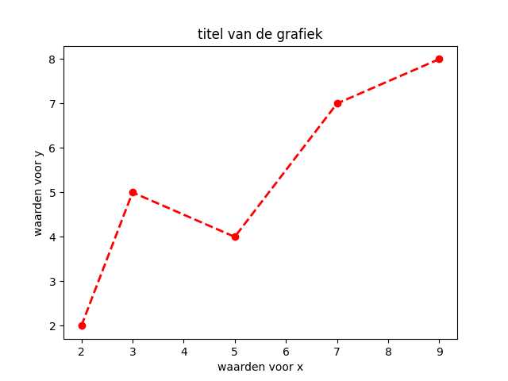
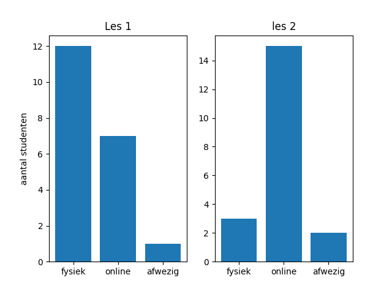

# Getallen manipuleren en visualiseren met NumPy en plot

## Doelstellingen

Na dit hoofdstuk kan je:

- NumPy arrays maken op verschillende manieren: door de lijst op te geven, met willekeurige getallen, met één-waarden, met nul-waarden.
-  elementen selecteren en filteren met slicing en indexing.
- shape, dimensie en size opvragen.
- een vector en een matrix overlopen, een matrix transposen en herschikken, een vector sorteren, een matrix platslaan, vectoren en matrices combineren.
- een vector of matrix wijzigen.
- elementaire aggregaties en statistische functies om vectoren toepassen.
- een eenvoudige grafiek (lijn, spreiding, kolom, taart) maken op basis van NumPy arrays. Je kan titels en labels toevoegen en de kleur en weergave van de grafiek bepalen.

## Bronnen

[De website van Numpy](https://numpy.org/)

[Beginnersgids voor NumPy](https://numpy.org/doc/stable/user/absolute_beginners.html)

[wiskundige functies van NumPy](https://numpy.org/doc/stable/reference/routines.math.html)

[statistische functies in NumPy](https://numpy.org/doc/stable/reference/routines.statistics.html)

[Matplotlib](https://matplotlib.org/)

[Overzicht grafieken die je met Matplotlib kan maken](https://matplotlib.org/stable/gallery/index.html)

## Wat is NumPy?

Tot nu toe hebben we enkel gewerkt met modules die ingebouwd waren in Python. De ware kracht van Python toont zich vooral wanneer we externe modules zullen gebruiken die bepaalde handelingen eenvoudig of erg snel kunnen uitvoeren. In sommige gevallen zijn die externe modules achterliggend in de programmeertaal C geprogrammeerd en werken ze erg snel.

Eén van die modules is NumPy. Het pakket NumPy is gebouwd om wetenschappelijke berekeningen snel en flexibel te kunnen uitvoeren. Het voorziet in modules voor matrices en andere meerdimensionele arrays en voorziet functies om cijfers snel te sorteren, te wijzigen, te filteren en wiskundige en statistische berekeningen te doen.

Wij zullen niet alle aspecten van NumPy verkennen. Waar we naar streven, is een kennismaking met NumPy zodat de drempel is weggenomen voor wie nood heeft aan dit pakket en dit pakket verder wil verkennen.

## NumPy installeren en importeren

Numpy installeren doe je, zoals we gewoon zijn, met het pakket `pip`.

```bash
pip install numpy
```

Het is mogelijk dat je `pip3` als commando moet gebruiken.

Wanneer we een pakket installeren, dan creëren we liefst eerst een virtuele omgeving:

```bash
# virtuele omgeving creëren in de map .venv
python -m venv .venv

# virtuele omgeving activeren in linux of mac
source .venv/bin/activate

# virtuele omgeving activeren in Windows via bat-bestand
# .venv/Scripts/activate.bat

# virtuele omgeving activeren in Windows via PowerShell
# .venv/Scripts/Activate.ps1

# numpy installeren in je virtuele omgeving
pip install numpy
```

Vooraleer we de functie van NumPy kunnen gebruiken, importeren we de module in onze code. We kunnen in principe gelijk welke alias kiezen, maar de conventie is dat we deze `np` noemen:

```python
import numpy as np
```

## NumPy array

We kennen een list in Python. Een list kan ongelijksoortige objecten bevatten. Een NumPy array is gelijkaardig aan een list, met dat verschil dat alle objecten in de lijst van hetzelfde type zijn. Dat maakt een efficiënte verwerking van de array mogelijk. Dit type array neemt ook minder geheugenruimte in.

Een NumPy array kan uit één of meerdere dimensies bestaan. We waarden van een array bereiken we via een index. Dat kan een positief geheel getal zijn, een boolean of een andere array. We tonen dit aan de hand van een aantal voorbeelden.

In onderstaand voorbeeld creëren we een tweedimensionele array, ook wel matrix genoemd, en printen het eerste element. Standaard is de index een geheel getal, te beginnen bij 0. Een eendimensionale array noemen we een vector.

```python
a = np.array([[1, 2, 3, 4], [5, 6, 7, 8], [9, 10, 11, 12]])
print(a[0]) #  [1 2 3 4]
print(a[1][2]) # 7
print(a[1,2]) # 7
print(a[2,3]) # 12
print(a[3,3]) # IndexError: index 3 is out of bounds for axis 0 with size 3
```

In bovenstaand voorbeeld zie je hoe een array gecreëerd wordt, met het commando `np.array`, en met een list als argument.

Wanneer je een array wil opvullen met een rij getallen, dan kan dit op eenvoudige wijze met een aantal basiscommando's:

```python
nulrij = np.zeros(5) # een array met vijf nullen: array([0. , 0., 0., 0., 0.])
eenrij = np.ones(6) # een array met zes eentjes: array([1., 1., 1., 1., 1., 1.])
willekeurigerij = np.empty(3) # een array met drie willekeurige elementen: array(3., 2., 1.)
```

Je kan ook een array maken met meer gestructureerd elementen via `np.arange([start,] stop[, step])

```python
rij1 = np.arange(5) # [0 1 2 3 4]
rij2 = np.arange(6,10) # [6 7 8 9] # beginpunt zes, eindpunt 10 (eindpunt niet erbij)
rij3 = np.arange(0, 11, 2) # [0, 2, 4, 6, 8, 10] # beginput 0, eindpunt 11, step 2
```

Array zijn homogeen. Je kan dus het type van de elementen opvragen. Dat doe je met `dtype`. 

```python
nulrij = np.zeros(5)
print(rij.dtype) # int64
willekeurigerij = np.empty(3)
print(willekeurigerij.dtype) # float64
beweringen = np.array([False, True, True, False])
print(beweringen.dtype) # bool
```


## Slicing en indexing

Net zoals een list kan je elementen uit een NumPy array selecteren met sliding.

We illustreren dit met een aantal voorbeelden:

```python
rij = np.arange(10) # [0 1 2 3 4 5 6 7 8 9]
print(rij[2:5]) # [2 3 4] van tweede tot vijfde elemente, grenzen niet meegerekend
print(rij[3:]) # [3 4 5 6 7 8 9] vanaf derde (derde niet erbij) tot einde.
print(rij[:3]) # [0 1 2] vanaf begin drie elementen
print(rij[-3:]) # [7 8 9] de drie laatste elementen
print(rij[:-3]) # [0 1 2 3 4 5 6] alle elementen vanaf het begin, behalde de drie laatste
```

In plaats van slicing, kan je ook elementen selecteren op basis van een voorwaarde. We noemen dat indexing.

```python
print(rij[rij%2 == 0]) # [0 2 4 6 8] alle even elementen
print(rij[rij > 5]) # [6 7 8 9] alle elementen groter dan 5
print(rij[(rij%2 ==  0) & (rij > 5)]) # [6 8] alle even elementen groter dan 5
```

In plaats van een voorwaarde, kan je ook een array van booleaanse waarden definiëren.

```python
v = np.array([100, 200, 300, 400])
select = [False, True, True, False]  # 2e en 3e element selecteren
print(v[select]) # [200, 300]

```

Je kan ook enkel de unieke waarden van een vector krijgen met de functie `unique`

```python
a = np.array([11, 11, 12, 13, 14, 15, 16, 17, 12, 13, 11, 14, 18, 19, 20])
print(np.unique(a)) # [11 12 13 14 15 16 17 18 19 20]
```


## Shape, size en dimensie

We kunnen gegevens over onze array opvragen: de shape, de size en de dimensie.

*  dimensie: één voor een vector, twee voor een matrix (`ndarray.ndim`).
* size: het totaal aantal elementen in de array. Voor een tweedimensionele array is dat het product van het aantal elementen in een rij en het aantal rijen (`ndarray.size`).
* shape: het aantal elementen in elke dimensie (`endarray.shape`). Een matrix van twee rijen en drie kolommen zal `(2, 3)` als shape hebben.

Voorbeelden zullen dit illustreren:

```python
mijnvector = np.arange(10) # [0 1 2 3 4 5 6 7 8 9]
print(mijnvector.ndim, mijnvector.size, mijnvector.shape) # 1 10 (10,)
mijnmatrix = np.array([[1, 2, 3], [4, 5, 6]])
print(mijnmatrix.ndim, mijnmatrix.size, mijnmatrix.shape) # 2 6 (2, 3)
```

De shape wordt bijvoorbeeld gebruikt wanneer een een array met willekeurige waarden willen creëren. Met de functies `random()` en `randint` kunnen we snel matrices met willekeurige getallen genereren. Deze functies zitten in de module `np.random`. Je geeft de shape i.e. het aantal rijen en kolommen als tuple mee.

```python
willekeurig = np.random.rand(4, 2) # [[0.32513627, 0.83181569],
       														#	[0.83691663, 0.05733525],
       														#	[0.63533219, 0.58083827],
     															#  [0.68097897, 0.71657645]]
willekeuringint = np.random.randint(low=1, high=10, size=(2,4))
# [[7, 8, 4, 4], [1, 6, 6, 6]]
```

## Numpy arrays overlopen, sorteren, aanpassen

Je kan een array altijd **overlopen** met een for-lus:

```python
m = np.array([['a', 'b', 'c'], ['d', 'e', 'f']])
for rij in m:
  for element in rij:
    print(element, end=" ")
# a b c d e f 
```

Een alternatief is de nditer-functies:

```python
for element in np.nditer(m):
  print(element, end=" ")
# a b c d e f 
```

**Sorteren** gebeurt met de functie `sort()`. De array wordt hierbij gewijzigd.

```python
r = np.random.rand(2, 3) 
# [0.58020338 0.78299494 0.12514963] [0.51775737 0.59424713 0.38421092]]
r.sort() # per rij, axis=1
# [[0.12514963 0.58020338 0.78299494] [0.38421092 0.51775737 0.59424713]]
r.sort(axis=0)
# [[0.12514963 0.51775737 0.59424713] [0.38421092 0.58020338 0.78299494]]
```

Een array omkeren doe je met `flip()`.

```python
r = np.array([3, 1, 2])
r.sort()
r = np.flip(r)
print(r) # [3 2 1]
```

Arrays **aan elkaar plakken** doe je met `concatenate((x1, x2), axis=0)`

```python
a = np.array([1, 2, 3, 4])
b = np.array([5, 6, 7, 8])
np.concatenate((a, b)) # [1, 2, 3, 4, 5, 6, 7, 8])
x = np.array([[1, 2], [3, 4]])
```

Je kan ook rekendige operaties op een vector toepassen zonder een loop te gebruiken en dat is niet alleen leesbaarder, maar ook veel sneller. We spreken hier van een **gevectoriseerde expressie**.

```python
a1 = np.array([2, 6, 5])
a3 = a1 * 10 # [20 60 50] alle elementen maal 10
a5 = a1 + 5 # [ 7 11 10] alle elementen plus 5
```

Je kan een matrix **herschikken** met `reshape()` en `transpose()`.

Met transpose keren we de dimensies om. Rijen worden kolommen en kolommen worden rijen.

```python
a = np.array([[1, 2, 3, 4], [5, 6, 7, 8], [9, 10, 11, 12]])
b = a.transpose()
print(b)
```

Output:

```bash
[[ 1  5  9]
 [ 2  6 10]
 [ 3  7 11]
 [ 4  8 12]]
```

Met reshape wijzig je de dimensies (shape), maar de elementen worden in dezelfde volgorde herverdeeld over de rijen en kolommen. Uitgaande van het vorige voorbeeld:

```python
c = a.reshape(4,3)
print(c)
```

Output:

```bash
[[ 1  2  3]
 [ 4  5  6]
 [ 7  8  9]
 [10 11 12]]
```

Je kan ook een matrix **platslaan**. Daarmee bedoelen we dat je er een vector van maakt. Dat gebeurt met de functie `flatten()`.

```python
d = a.flatten()
print(d)
```

Output:

```bash
[ 1  2  3  4  5  6  7  8  9 10 11 12]
```

We hebben zeker niet alle functies om vectoren en matrices aan te passen, behandeld, maar we houden het bij deze.

## Shallow versus deep copy

We moeten goed opletten wanneer we een vector of matrix aanpassen. In de meeste gevallen maakt NumPy een view, een kijk op een deel van de gegevens zonder de gegevens werkelijk te kopiëren. Wanneer je een aanpassing doet op de view of op de oorspronkelijke array, dat blijft hetzelfde. Slicing is een goed voorbeeld van een functie die een shallow copy maakt, enkel een view met een nieuwe verwijzing naar die view.

```python
a = np.array([[1, 2, 3, 4], [5, 6, 7, 8], [9, 10, 11, 12]])
b1 = a[0,1:]
print(b1) # [2 3 4]
b1[0] = 99
print(b1) # [99  3  4]
print(a)
```

Output:

```python
[[ 1 99  3  4]
 [ 5  6  7  8]
 [ 9 10 11 12]]
```

Wil je een volledige copy maken, waarbij de kopie geen verwijzing meer heeft naar de oorspronkelijke array, dan gebruiken we de functie `copy()`.

```python
b2 = a.copy()
b2[0,0] = 100
print(b2)
```

Output:

```bash
[[100  99   3   4]
 [  5   6   7   8]
 [  9  10  11  12]]
```

```python
print(a)
```

Output:

```bash
[[ 1 99  3  4]
 [ 5  6  7  8]
 [ 9 10 11 12]]
```


## Aggregaties en statistische functies in NumPy Arrays

De kracht van NumPy Arrays is dat je heel snel samenvattende waarden kan berekenen. We geven enkele voorbeelden:

* Som: som van alle elementen `sum(a)`
* Optellen: elementen van twee arrrays element per element optellen `add(x1, x2)`.
* Minimum: `min(a)`
* Maximum: `max(a)`
* Gemiddelde: `mean(a)`
* Afronden: `round(a)`
* Product: product van alle elementen `prod()`
* Vermenigvuldigen: elementen van twee arrays element per element vermenigvuldigen `multiply(x1, x2)`
* Mediaan: `median(a)`

Het aantal wiskundige en statistische functies in NumPy is duizelingwekkende.

Voorbeelden:

```python
tbl = np.array([[1, 2, 3], [4, 5, 6]])
print('sum:', tbl.sum()) # 21
print('min:', tbl.min()) # 1
print('max:', tbl.max()) # 6
print('mean:', tbl.mean()) # 3.5

a1 = np.array([2, 6, 5])
a2 = np.array([3, 2, 8])
opgeteld = np.add(a1, a2)
print(opgeteld) # [ 5  8 13]
vermenigvuldigd = np.multiply(a1, a2)
print(vermenigvuldigd) # [ 6 12 40]
```

## Matplotlib

Matplotlib is een module om gegevens te visualiseren. Waar je met NumPy een enorm krachtige tool hebt om gegevens te analyseren, lijkt het wel of je met Matplotlib een oneindig gamma aan mogelijkheden hebt om gegevens te visualiseren. Bedenkt een grafiek en je kan die wel tekenen met matplotlib.

Wij beperken ons tot enkele basisgrafieken.

## Installeren en importeren van Matplotlib

De installatie is zoals gewoonlijk eenvoudig met `pip`. De meeste functies die we nodig hebben, bevinden zich in de submodule `pyplot`. We gaan dus enkel deze importeren. Traditioneel noemen we die dan `plt`.

```python
import numpy as np
import matplotlib.pyplot as plt
```

## Een eenvoudige lijngrafiek maken

Laten we beginnen met een eenvoudige lijngrafiek die de waarden van 1 tot 100 toont. Je vertrekt van een vector. Met `plot()` maak je dan de grafiek en met `show()` wordt hij getoond.

```python
import numpy as np
import matplotlib.pyplot as plt

y = np.arange(101)
plt.plot(y)
plt.show()
```


Iets complexer is het als we gegevens telkens een x-waarde en een y-waarde hebben. Dan moeten we uitgaan van twee vectoren: één met de x-waarden en één met de y-waarden.

```python
x = [2, 3, 5, 7 , 9]
y = [2, 5, 4, 7, 8]
plt.plot(x, y)
plt.show()
```


## De lijngrafiek opmaken

In onderstaande grafiek zullen we de kleur veranderen, de x-as een label geven, de y-as een label geven en de titel aanpassen.

De **kleuren** kan je aanpassen via een lettercode ('k' is bijvoorbeeld zwart). Je kan de kleuren ook voluit schrijven (black, bleu, red, green, yellow, cyan, magenta, ...) of je kan een RGB-waarde opgeven. Een rgb-waarde bestaat uit drie getallen. We geven de kleur mee in de plotfunctie.  De naam van het argument is 'color'.

Het **lijntype** is het argument 'linestyle'. Dat kan ':' zijn voor een stippellijn, '-' voor een volle lijn, '--' voor een streepjeslijn en '-.' voor een puntstreeplijn.

Je kan ook een **marker** opgeven. Daarmee geef je aan of op de waarden ook een punt ('o'), een vierkantje ('s' voor square) of helemaal niets komt.

De **lijndikte** kan je aanpassen met het argument linewidth.

Laten we eens de vorige grafiek eens opnieuw weergeven, maar met puntjes, een stippellijn, kleur rood en een iets dikkere lijn. We voorzien ook labels en een titel.

```python
x = [2, 3, 5, 7 , 9]
y = [2, 5, 4, 7, 8]
plt.plot(x, y, color='red', linewidth='2', linestyle='--', marker='o')
plt.xlabel("waarden voor x")
plt.ylabel("waarden voor y")
plt.title("titel van de grafiek")
plt.show()
```



We kunnen ook meerdere lijnen in één grafiek plotten en de legende toevoegen.

```python
import matplotlib.pyplot as plt
 
year = [1972, 1982, 1992, 2002, 2012]
e_india = [100.6, 158.61, 305.54, 
           394.96, 724.79]
 
e_bangladesh = [10.5, 25.21, 58.65,
                119.27, 274.87]
 
plt.plot(year, e_india, color ='orange',
         marker ='o', markersize = 12, 
         label ='India')
 
plt.plot(year, e_bangladesh, color ='g',
         linestyle ='dashed', linewidth = 2,
         label ='Bangladesh')
 
plt.xlabel('Years')
plt.ylabel('Power consumption in kWh')
 
plt.title('Electricity consumption per \
capita of India and Bangladesh')
 
plt.legend()
plt.show()
```


## Subplots

Hieronder vind je een voorbeeld van meerdere subplots in één figuur. Dit is tevens een voorbeeld van een kolomgrafiek (bar).

```python
categorieen = ['fysiek', 'online', 'afwezig']  # aanwezigheid in les
aantal_studenten_les1 = [12, 7, 1]  # aantal studenten per categorie voor les 1 
aantal_studenten_les2 = [3, 15, 2]  # aantal studenten per categorie voor les 2

# we creëren 2 subplots in 1 rij en 2 kolommen
plt.subplot(1, 2, 1)  # de eerste subplot
plt.bar(categorieën, aantal_studenten_les1)
plt.ylabel('aantal studenten')  # voeg y-label toe
plt.title('Les 1')  # voeg een titel toe

plt.subplot(1, 2, 2)  # de twee subplot
plt.bar(categorieen, aantal_studenten_les2)
plt.title('les 2')  # voeg een titel toe

plt.show()
```



De `subplot()` functie heeft als eerste argument het aantal  rijen subplots, dan het aantal kolommen en tenslotte de hoeveelste  subplot je wil tekenen. Dus `subplot(1, 2, 2)` betekent dat er 1 rij en 2 kolommen subplots zijn en dat de tweede plot aan de beurt is.

## Grafiektypes

Zoals we al vermeld hebben is het aantal grafiektypes bij pyplot schier oneinder. We vermelden er enkele:

- Lijngrafiek: `plt.plt`. We geven de waarden voor de x-as en de waarden voor de y-as mee.
- Spreidingsgrafiek: `plt.scatter()`. Hier zullen we minstens x-waarden en y-waarden hebben.
- Kolomgrafiek: `plt.bar()`. We zagen in het voorbeeld dat deze minstens twee argumenten heeft: de categorieën en de hoogtes.
- Taartgrafiek: `plt.pie()`. We geven een vector met waarden weer. We kunnen ook een vector met labels meegeven.
- Horizontale staafgrafiek: `plt.barh()`.

