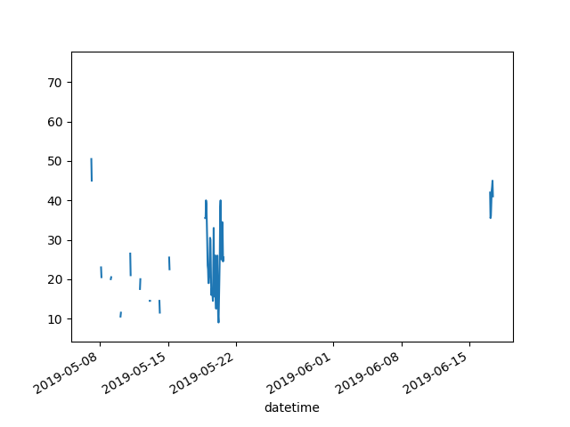

# Gegevensanalyse met Pandas

## Doelstellingen

Na dit hoofdstuk kan je:

* een dataframe maken op basis van bestaande lijsten of dicitonaries.
* een series maken.
* de gegevens in een dataframe verkennen.
* de gegevens in een dataframe omzetten (stringoperaties, datatypeconversie).
* de kolomnamen in een dataframe wijzigen.
* kolommen verwijderen in een dataframe.
* kolommen toevoegen in een dataframe.
* gegevens filteren op kolommen of rijen, basis van kolomnamen, voorwaarden, indexen en slicing.
* statistische analyse uitvoegen op de gegevens van een dataframe, zonder en met groepering.
* gegevens in een dataframe inlezen vanuit een csv-bestand, een Excelbestand, een json-bestand of een sqlite3-databank.
* gegevens uit een dataframe wegschrijven naar een csv-bestand, een Excelbestand of een json-bestand.
* gegevens visualiseren in een lijnplot, een scatterplot, een staafdiagram of een taartdiagram.

## Bronnen

[De officiële site van Pandas](https://pandas.pydata.org/)

## Wat is Pandas?

Pandas is een Pythonbibliotheek die bij uitstek geschikt is om grote hoeveelheden gegevens te verwerken en te analyseren. Wanneer je met een verzameling van tienduizenden gegevens zit, dan is het misschien geen goed idee om dit in Excel te verwerken. Met Pandas is dit een fluitje van een cent.

De installatie van Pandas gebeurt via `pip`. Vergeet ook niet een virtuele omgeving te creëren.

```bash
python -m venv .env
source .env/bin/activate # Windows: .env/Scripts/activate.bat
pip install pandas
```

In ons Pythonbestand zullen we dan Pandas importeren.

```python
import pandas as pd # we noemen het pakket pd bij conventie
```

## Datastructuren in Pandas

De twee basis datastructuren die pandas gebruikt zijn: `Series` en `DataFrame`.

`Series` is ééndimensionaal (één kolom), `DataFrame` is tweedimensionaal (tabel met rijen en kolommen). Pandas is bovenop  NumPy ontwikkeld en is daardoor heel efficiënt op vlak van rekenkracht. Beide datatypes kunnen alle soorten objecten bevatten.

We maken een een `Series` door een lijst van waarden mee te geven met de functies `pd.Series()`. We kunnen ook een index meegeven. Dat is een lijst van labels. Die lijst moet natuurlijk even lang zijn als de lijst van gegevens. Als we geen lijst van labels meegeven, dan neemt hij gehele getallen vanaf 0 zoals bij een lijst.

```python
import pandas as pd
import numpy as np

rij = pd.Series(np.random.randn(5))
print(rij)
```

Output:

```
0    0.309326
1   -0.394174
2    1.722596
3   -0.644675
4   -1.048602
dtype: float64
```
Voorbeeld waarbij we zelf een index definiëren:

```python
s = pd.Series(np.random.randn(5), index=["a", "b", "c", "d", "e"])
print(s)
```

Output:

```bash
a   -0.179841
b    0.474589
c    0.304474
d    0.667548
e   -0.996806
dtype: float64
```

We kunnen een `Series` ook aanmaken vanuit een dict. De keys zijn dan de indexen.

```python
d = {"b": 1, "a": 0, "c": 2}
print(pd.Series(d))
```

Output:

```text
b    1
a    0
c    2
dtype: int64
```

Een `DataFrame` is tweedimensioneel en bestaat uit kolommen en kolomkoppen. Je kan een `DataFrame` maken op basis van o.a. een reeks elementen van het type `Series`, een numpy,ndarray of een aander `DataFrame`. Je kan ook een dict opgeven. We illustreren dit met een voorbeeld.

```python
import pandas as pd

# Maak een DataFrame aan (2-dimensionaal object), via een 'dictionary of lists'.
my_data_frame = pd.DataFrame({
    "Name": ["Pol", "Romeo", "Thomas", "An"],
    "Age": [25, 65, 63, 21],
    "Sex": ["male", "male", "male", "female"]
})

# DataFrame dumpen. 
# Merk op dat de key van de dictionary gebruikt wordt als kolomnaam, de waardes uit de lijst als rijdata.
print(my_data_frame)
```

Output:

```text
     Name  Age     Sex
0     Pol   25    male
1   Romeo   65    male
2  Thomas   63    male
3      An   21  female
```

## Gegevens opvragen uit een Series of DataFrame

Elke kolom in een `DataFrame` is eigenlijk een `Series`. Je kan die dus apart opvragen. Nemen we het bovenstaande voorbeeld opnieuw:

```python
print(my_data_frame["Age"])
```

Output:

```text
0    25
1    65
2    63
3    21
```

Je kan één element opvragen aan de hand van de index: `my_data_frame["Age"][0]` levert de waarde 25 op.


## Data uit diverse bronnen ophalen en wegschrijven

### CSV en Excel

Naast de snelle statistische analyse is een kracht van Pandas dat je heel gemakkelijk gegevens uit diverse bronnen kunt ophalen. In onderstaand voorbeeld maken we een dataframe door gegevens uit het csv-bestand `titanic.csv` in te lezen:

```python
titanic_data_frame = pd.read_csv("titanic.csv")
```

Pandas maakt een dataframe en converteert alle gegevens naar het juiste datatype. We kunnen nu bijv. de eerste tien elementen opvragen:

```python
titanic_data_frame.head(10)
```

```text
PassengerId  Survived  Pclass  ...     Fare Cabin  Embarked
0            1         0       3  ...   7.2500   NaN         S
1            2         1       1  ...  71.2833   C85         C
2            3         1       3  ...   7.9250   NaN         S
3            4         1       1  ...  53.1000  C123         S
4            5         0       3  ...   8.0500   NaN         S
5            6         0       3  ...   8.4583   NaN         Q
6            7         0       1  ...  51.8625   E46         S
7            8         0       3  ...  21.0750   NaN         S
8            9         1       3  ...  11.1333   NaN         S
9           10         1       2  ...  30.0708   NaN         C
```

We kunnen ook een dataframe naar een csv-bestand wegschrijven

```python
df = pd.DataFrame({"brand": ["Mercedes", "BMW", "Audi"], 
                   "color": ["white", "black", "blue"]})
df.to_csv("cars.csv", sep=",", index=False)  # default separator is ','
```

Door `index=False` te zetten, zorg je ervoor dat de rijnummers niet mee opgeslagen worden.

CSV-files kan je gemakkelijk inlezen in Excel. Maar met pandas kan je ook rechtstreeks een `DataFrame` naar een Excel-file wegschrijven, door gebruik te maken van de `to_excel()` methode. En zo zijn er nog andere `to_*` methodes, zoals `to_html()`, `to_json()`, `to_sql()`, ...

```python
# wegschrijven naar een Excel-bestand.
titanic_data_frame.to_excel("myTitanicExcelFile.xlsx", sheet_name="passengerlist", index=False)
```

Als je de error "No module named 'openpyxl'" krijgt, installeer dan deze module met `pip install openpyxl`.


Omgekeerd kan ook, rechtstreek van een Excel-bestand naar een pandas `DataFrame`:

```python
titanic_data_frame_from_excel = pd.read_excel("myTitanicExcelFile.xlsx", sheet_name="passengerlist")
```

Als je de error "Missing optional dependency 'xlrd'" krijgt, installeer dan deze module met `pip install xlrd`.

ens je een csv- of Excel-file hebt ingelezen als `DataFrame`, dan is het aan te raden om de tabel te gaan onderzoeken. 'Technische' informatie over een `DataFrame` kan je opvragen via de `info()` methode:

```python
titanic_data_frame.info()
```

```text
<class 'pandas.core.frame.DataFrame'>
RangeIndex: 891 entries, 0 to 890
Data columns (total 12 columns):
 #   Column       Non-Null Count  Dtype  
---  ------       --------------  -----  
 0   PassengerId  891 non-null    int64  
 1   Survived     891 non-null    int64  
 2   Pclass       891 non-null    int64  
 3   Name         891 non-null    object 
 4   Sex          891 non-null    object 
 5   Age          714 non-null    float64
 6   SibSp        891 non-null    int64  
 7   Parch        891 non-null    int64  
 8   Ticket       891 non-null    object 
 9   Fare         891 non-null    float64
 10  Cabin        204 non-null    object 
 11  Embarked     889 non-null    object 
dtypes: float64(2), int64(5), object(5)
memory usage: 83.7+ KB
```

### Json

```python
import pandas as pd
import matplotlib.pyplot as plt
import json

# JSON-bestand importeren.
co2_values = pd.read_json("co2.json", typ='series')
```

### Database

```python
import sqlite3
from sqlite3 import Error
import pandas as pd

try:
  conn = sqlite3.connect("chinook.db")
except Error as e:
  print(e)

sql_query = """
SELECT Title, Name
FROM albums
INNER JOIN artists ON artists.ArtistID = albums.ArtistID
"""

albums = pd.read_sql_query(sql_query, conn)
albums.head()
conn.close()
```

| Title | Name                                  |           |
| ----- | ------------------------------------- | --------- |
| 0     | For Those About To Rock We Salute You | AC/DC     |
| 1     | Balls to the Wall                     | Accept    |
| 2     | Restless and Wild                     | Accept    |
| 3     | Let There Be Rock                     | AC/DC     |
| 4     | Big Ones                              | Aerosmith |

## Een subset selecteren uit een DataFrame

Wil je meerdere **kolommen** uit een `DataFrame` selecteren, gebruik dan dubbele vierkante haakjes. De binnenste haakjes maken een Python `list` die aan de hand van de kolomkoppen aangeeft dat welke kolommen je wil zien, de buitenste haakjes worden gebruikt om aan te geven dat je een selectie wil maken van een `DataFrame`.

```python
# pandas importeren, uiteraard via 'pd'.
import pandas as pd

# Gebruik opnieuw de 'titanic.csv' om data uit te lezen.
titanic_data_frame = pd.read_csv("titanic.csv")

# Selecteer twee kolommen. Het resultaat is opnieuw een DataFrame.
age_and_sex = titanic_data_frame[["Age", "Sex"]]
print(age_and_sex)
```

```text
	Age	Sex
0	22.0	male
1	38.0	female
2	26.0	female
3	35.0	female
4	35.0	male
...	...	...
886	27.0	male
887	19.0	female
888	NaN	female
889	26.0	male
890	32.0	male
891 rows × 2 columns
```

Wil je meerdere **rijen** uit een `DataFrame` selecteren, gebruik een voorwaarde binnen de vierkante haakjes. Zoek bijvoorbeeld de personen ouder dan 39 in de lijst van passagiers op de Titanic.

```python
older_than_39 = titanic_data_frame[titanic_data_frame["Age"] > 39]
print(older_than_39)
```

```text
     PassengerId  Survived  Pclass                                               Name     Sex   Age  SibSp  Parch      Ticket     Fare Cabin Embarked
6              7         0       1                            McCarthy, Mr. Timothy J    male  54.0      0      0       17463  51.8625   E46        S
11            12         1       1                           Bonnell, Miss. Elizabeth  female  58.0      0      0      113783  26.5500  C103        S
15            16         1       2                   Hewlett, Mrs. (Mary D Kingcome)   female  55.0      0      0      248706  16.0000   NaN        S
30            31         0       1                           Uruchurtu, Don. Manuel E    male  40.0      0      0    PC 17601  27.7208   NaN        C
33            34         0       2                              Wheadon, Mr. Edward H    male  66.0      0      0  C.A. 24579  10.5000   NaN        S
..           ...       ...     ...                                                ...     ...   ...    ...    ...         ...      ...   ...      ...
862          863         1       1  Swift, Mrs. Frederick Joel (Margaret Welles Ba...  female  48.0      0      0       17466  25.9292   D17        S
865          866         1       2                           Bystrom, Mrs. (Karolina)  female  42.0      0      0      236852  13.0000   NaN        S
871          872         1       1   Beckwith, Mrs. Richard Leonard (Sallie Monypeny)  female  47.0      1      1       11751  52.5542   D35        S
873          874         0       3                        Vander Cruyssen, Mr. Victor    male  47.0      0      0      345765   9.0000   NaN        S
879          880         1       1      Potter, Mrs. Thomas Jr (Lily Alexenia Wilson)  female  56.0      0      1       11767  83.1583   C50        C

[163 rows x 12 columns]

```

Bovenstaande werkt omdat de voorwaarde `titanic_data_frame["Age"] > 39` een `Series` van `bool` teruggeeft. Die `Series` wordt dan gebruikt om te filteren in het origineel `DataFrame`.

```python
# Bekijk de output. Zie je al de booleans...?
age_filter = titanic_data_frame["Age"] > 39
print(age_filter)
```

```text
0      False
1      False
2      False
3      False
4      False
       ...  
886    False
887    False
888    False
889    False
890    False
Name: Age, Length: 891, dtype: bool
```

Filteren op 'reisklasse' kan door de method `isin()` te gebruiken. Zoek bijvoorbeeld alle passagiers die in eerste en tweede klasse reizen. Dat doe je door bijvoorbeeld een `list`-like object mee te geven aan die method.

```python
class_one_and_two_passengers = titanic_data_frame[titanic_data_frame["Pclass"].isin([1,2])]
print(class_one_and_two_passengers)
```

```text
     PassengerId  Survived  Pclass  ...     Fare Cabin  Embarked
1              2         1       1  ...  71.2833   C85         C
3              4         1       1  ...  53.1000  C123         S
6              7         0       1  ...  51.8625   E46         S
9             10         1       2  ...  30.0708   NaN         C
11            12         1       1  ...  26.5500  C103         S
..           ...       ...     ...  ...      ...   ...       ...
880          881         1       2  ...  26.0000   NaN         S
883          884         0       2  ...  10.5000   NaN         S
886          887         0       2  ...  13.0000   NaN         S
887          888         1       1  ...  30.0000   B42         S
889          890         1       1  ...  30.0000  C148         C

[400 rows x 12 columns]

```

Van sommige passagiers is geen leeftijd gekend. Als je jouw bewerkingen wil doen op de lijst van passagiers waar wel een leeftijd is ingevuld, kan je werken met de method `notna()`. Die returnt `True` als er een niet `Null` waarde gevonden werd.

```python
passengers_with_age = titanic_data_frame[titanic_data_frame["Age"].notna()]
print(passengers_with_age)
```

```text
     PassengerId  Survived  Pclass                                               Name     Sex   Age  SibSp  Parch            Ticket     Fare Cabin Embarked
0              1         0       3                            Braund, Mr. Owen Harris    male  22.0      1      0         A/5 21171   7.2500   NaN        S
1              2         1       1  Cumings, Mrs. John Bradley (Florence Briggs Th...  female  38.0      1      0          PC 17599  71.2833   C85        C
2              3         1       3                             Heikkinen, Miss. Laina  female  26.0      0      0  STON/O2. 3101282   7.9250   NaN        S
3              4         1       1       Futrelle, Mrs. Jacques Heath (Lily May Peel)  female  35.0      1      0            113803  53.1000  C123        S
4              5         0       3                           Allen, Mr. William Henry    male  35.0      0      0            373450   8.0500   NaN        S
..           ...       ...     ...                                                ...     ...   ...    ...    ...               ...      ...   ...      ...
885          886         0       3               Rice, Mrs. William (Margaret Norton)  female  39.0      0      5            382652  29.1250   NaN        Q
886          887         0       2                              Montvila, Rev. Juozas    male  27.0      0      0            211536  13.0000   NaN        S
887          888         1       1                       Graham, Miss. Margaret Edith  female  19.0      0      0            112053  30.0000   B42        S
889          890         1       1                              Behr, Mr. Karl Howell    male  26.0      0      0            111369  30.0000  C148        C
890          891         0       3                                Dooley, Mr. Patrick    male  32.0      0      0            370376   7.7500   NaN        Q

[714 rows x 12 columns]
```

Wil je meerdere RIJEN en KOLOMMEN uit een `DataFrame` selecteren, gebruik dan opnieuw de vierkante haakjes maar met daartussen eerst de rijen en daarna de kolommen (door komma gescheiden). Let wel op: je moet de `loc/iloc` operator gebruiken! De `loc` is voor gebruik met kolomnamen, rij labels of condities. De `iloc` is voor gebruik via indexen.

```python
# Zoek bijvoorbeeld enkel de namen op van de volwassenen.
adult_names = titanic_data_frame.loc[titanic_data_frame["Age"] >= 18, "Name"]
adult_names
```

```text
0                                Braund, Mr. Owen Harris
1      Cumings, Mrs. John Bradley (Florence Briggs Th...
2                                 Heikkinen, Miss. Laina
3           Futrelle, Mrs. Jacques Heath (Lily May Peel)
4                               Allen, Mr. William Henry
                             ...                        
885                 Rice, Mrs. William (Margaret Norton)
886                                Montvila, Rev. Juozas
887                         Graham, Miss. Margaret Edith
889                                Behr, Mr. Karl Howell
890                                  Dooley, Mr. Patrick
Name: Name, Length: 601, dtype: object
```

```python
# Als je via indexen wil filteren, gebruik dus 'iloc'.
titanic_data_frame.iloc[3:6, 2:6]     # Rij 3 t.e.m. 5. Kolom 2 t.e.m. 5.
```

```text
   Pclass                                          Name     Sex   Age
3       1  Futrelle, Mrs. Jacques Heath (Lily May Peel)  female  35.0
4       3                      Allen, Mr. William Henry    male  35.0
5       3                              Moran, Mr. James    male   NaN
```

````python
# Je kan op die manier ook de data aanpassen. Stel dat je de namen van de eerste vier rijen wil veranderen naar 'unknown', doe dan:
titanic_data_frame.iloc[0:3,3] = "unknown"
titanic_data_frame.head(6)

````


```

   PassengerId  Survived  Pclass                                          Name     Sex   Age  SibSp  Parch            Ticket     Fare Cabin Embarked
0            1         0       3                                       unknown    male  22.0      1      0         A/5 21171   7.2500   NaN        S
1            2         1       1                                       unknown  female  38.0      1      0          PC 17599  71.2833   C85        C
2            3         1       3                                       unknown  female  26.0      0      0  STON/O2. 3101282   7.9250   NaN        S
3            4         1       1  Futrelle, Mrs. Jacques Heath (Lily May Peel)  female  35.0      1      0            113803  53.1000  C123        S
4            5         0       3                      Allen, Mr. William Henry    male  35.0      0      0            373450   8.0500   NaN        S
5            6         0       3                              Moran, Mr. James    male   NaN      0      0            330877   8.4583   NaN        Q
```

Zoals eerder vermeld, werkt `iloc` met indexen en `loc` met kolomnamen en voorwaarden. Laten we bijv. enkel de kolommen naam, geslacht, en leeftijd afdrukken. 

```python
print(titanic.loc[:, ["Name", "Sex", "Age"]])
```

We zien hier dat we eerste de rijen bepalen. Met ':' geven we aan dat we alle rijen. Voor de kolommen geven we een lijst met de kolomnamen.

Laten we nu hetzelfde doen, maar voor de rijen waarvan de leeftijd minimum dertig en maximum 39 is.

```python
print(titanic.loc[(titanic["Age"] >= 30) & (titanic["Age"] < 40), ["Name", "Sex", "Age"]])
```

We gebruiken de ampersand ('&') in plaats van 'and' en het pipesymbool ('|') in plaats van 'or'.


## Grafieken aanmaken in pandas

pandas werkt nauw samen met de matplotlib bibliotheek om zo knappe visualisaties van je data te bekomen. Hieronder enkele voorbeelden van hoe je snel grafieken kan tekenen vanuit Python/pandas.

Een aantal van deze voorbeelden leest een CSV-bestand in. Het bronbestand kan je vinden op: https://github.com/pandas-dev/pandas/tree/master/doc/data/air_quality_no2.csv of op Toledo.

Meer info over de parameters om een CSV-bestand in te lezen vind je hier: https://pandas.pydata.org/docs/reference/api/pandas.read_csv.html.

```python
# NO2-waardes inlezen uit een CSV-bestand. Merk op dat 'index_col' ervoor zorgt dat de eerste 
# kolom als index wordt gebruikt (unieke referentie) en dat 'parse_dates' ervoor zorgt dat de
# (index) waardes omgezet worden naar Timestamp objecten. Hiermee kan je later gemakkelijk 
# gaan 'filteren'.
air_quality = pd.read_csv("air_quality_no2.csv", index_col=0, parse_dates=True)
air_quality
```

```
                     station_antwerp  station_paris  station_london
datetime                                                           
2019-05-07 02:00:00              NaN            NaN            23.0
2019-05-07 03:00:00             50.5           25.0            19.0
2019-05-07 04:00:00             45.0           27.7            19.0
2019-05-07 05:00:00              NaN           50.4            16.0
2019-05-07 06:00:00              NaN           61.9             NaN
...                              ...            ...             ...
2019-06-20 22:00:00              NaN           21.4             NaN
2019-06-20 23:00:00              NaN           24.9             NaN
2019-06-21 00:00:00              NaN           26.5             NaN
2019-06-21 01:00:00              NaN           21.8             NaN
2019-06-21 02:00:00              NaN           20.0             NaN

[1035 rows x 3 columns]
```

Om matplotlib te gebruiken, moet die bibliotheek uiteraard eerst geïnstalleerd zijn. Mocht dat nog niet het geval zijn, dan kan dat onder andere door: **'pip install matplotlib'**.

```python
import matplotlib.pyplot as plt

# Eenvoudig alles dumpen in een pandas plot, via matplotlib op de achtergrond. Eén lijn 
# per kolom. Meer info over die plot functie van pandas: 
# https://pandas.pydata.org/docs/reference/api/pandas.Series.plot.html?highlight=plot#pandas-series-plot.
air_quality.plot()
plt.show()
```


```python
# Wil je enkel Antwerpen zien...
air_quality["station_antwerp"].plot()
plt.show()
```




## Nieuwe kolommen in een DataFrame aanmaken op basis van bestaande kolommen

Als voorbeeld nemen we de omrekening van de NO2-concentratie naar mg/m³. Rekening houdend met 25°C en een luchtdruk van 1013hPa, moet de waarde met 1.882 vermenigvuldigd worden... Verder is de omrekening niet zo belangrijk.

Zie: https://pandas.pydata.org/docs/getting_started/intro_tutorials/05_add_columns.html.

```python
# Extra kolom toevoegen na vermenigvuldigen met een factor. Merk op dat er dus per element 
# wordt vermenigvuldigd (één element uit één rij), zonder gebruik van lussen!
# Via 'air_quality["antwerp_mg_per_cubic_meter"]' maak je eerst een nieuwe kolom aan.
air_quality["antwerp_mg_per_cubic_meter"] = air_quality["station_antwerp"] * 1.882
print(air_quality)
```

```text
                     station_antwerp  station_paris  station_london  antwerp_mg_per_cubic_meter
datetime                                                                                       
2019-05-07 02:00:00              NaN            NaN            23.0                         NaN
2019-05-07 03:00:00             50.5           25.0            19.0                      95.041
2019-05-07 04:00:00             45.0           27.7            19.0                      84.690
2019-05-07 05:00:00              NaN           50.4            16.0                         NaN
2019-05-07 06:00:00              NaN           61.9             NaN                         NaN
...                              ...            ...             ...                         ...
2019-06-20 22:00:00              NaN           21.4             NaN                         NaN
2019-06-20 23:00:00              NaN           24.9             NaN                         NaN
2019-06-21 00:00:00              NaN           26.5             NaN                         NaN
2019-06-21 01:00:00              NaN           21.8             NaN                         NaN
2019-06-21 02:00:00              NaN           20.0             NaN                         NaN

[1035 rows x 4 columns]
```

Ook berekeningen tussen twee kolomen kan. Let op de backslash om geforceerd een statement te splitsen over meerdere lijnen!

```python
air_quality["ratio_paris_antwerp"] = \
    air_quality["station_paris"] / air_quality["station_antwerp"]
print(air_quality)
```

```
                     station_antwerp  station_paris  station_london  antwerp_mg_per_cubic_meter  ratio_paris_antwerp
datetime                                                                                                            
2019-05-07 02:00:00              NaN            NaN            23.0                         NaN                  NaN
2019-05-07 03:00:00             50.5           25.0            19.0                      95.041             0.495050
2019-05-07 04:00:00             45.0           27.7            19.0                      84.690             0.615556
2019-05-07 05:00:00              NaN           50.4            16.0                         NaN                  NaN
2019-05-07 06:00:00              NaN           61.9             NaN                         NaN                  NaN
...                              ...            ...             ...                         ...                  ...
2019-06-20 22:00:00              NaN           21.4             NaN                         NaN                  NaN
2019-06-20 23:00:00              NaN           24.9             NaN                         NaN                  NaN
2019-06-21 00:00:00              NaN           26.5             NaN                         NaN                  NaN
2019-06-21 01:00:00              NaN           21.8             NaN                         NaN                  NaN
2019-06-21 02:00:00              NaN           20.0             NaN                         NaN                  NaN

[1035 rows x 5 columns]

```

Je kan ook eenvoudig kolomnamen hernoemen. Of bijvoorbeeld in hoofdletters zetten.

```python
 Kolomnamen hernoemen.
air_quality_renamed =air_quality.rename(
    columns={"station_antwerp": "ANTW",
    "station_london": "London WM",
    "station_paris": "Paris"}
)
print(air_quality_renamed)
```

```
                     ANTW  Paris  London WM  antwerp_mg_per_cubic_meter  ratio_paris_antwerp
datetime                                                                                    
2019-05-07 02:00:00   NaN    NaN       23.0                         NaN                  NaN
2019-05-07 03:00:00  50.5   25.0       19.0                      95.041             0.495050
2019-05-07 04:00:00  45.0   27.7       19.0                      84.690             0.615556
2019-05-07 05:00:00   NaN   50.4       16.0                         NaN                  NaN
2019-05-07 06:00:00   NaN   61.9        NaN                         NaN                  NaN
...                   ...    ...        ...                         ...                  ...
2019-06-20 22:00:00   NaN   21.4        NaN                         NaN                  NaN
2019-06-20 23:00:00   NaN   24.9        NaN                         NaN                  NaN
2019-06-21 00:00:00   NaN   26.5        NaN                         NaN                  NaN
2019-06-21 01:00:00   NaN   21.8        NaN                         NaN                  NaN
2019-06-21 02:00:00   NaN   20.0        NaN                         NaN                  NaN

[1035 rows x 5 columns]
```

```python
# Alle kolomnamen in hoofdletters.
air_quality_renamed = air_quality_renamed.rename(columns=str.upper)
print(air_quality_renamed)
```

```
                     ANTW  PARIS  LONDON WM  ANTWERP_MG_PER_CUBIC_METER  RATIO_PARIS_ANTWERP
datetime                                                                                    
2019-05-07 02:00:00   NaN    NaN       23.0                         NaN                  NaN
2019-05-07 03:00:00  50.5   25.0       19.0                      95.041             0.495050
2019-05-07 04:00:00  45.0   27.7       19.0                      84.690             0.615556
2019-05-07 05:00:00   NaN   50.4       16.0                         NaN                  NaN
2019-05-07 06:00:00   NaN   61.9        NaN                         NaN                  NaN
...                   ...    ...        ...                         ...                  ...
2019-06-20 22:00:00   NaN   21.4        NaN                         NaN                  NaN
2019-06-20 23:00:00   NaN   24.9        NaN                         NaN                  NaN
2019-06-21 00:00:00   NaN   26.5        NaN                         NaN                  NaN
2019-06-21 01:00:00   NaN   21.8        NaN                         NaN                  NaN
2019-06-21 02:00:00   NaN   20.0        NaN                         NaN                  NaN

[1035 rows x 5 columns]
```


## Statistische gegevens uit je DataFrame ophalen

Je kan de samenvattende gegevens uit een `DataFrame` opvragen met `my_data_frame.describe()`. Dit geeft:

```text
             Age
count   4.000000
mean   43.500000
std    23.741665
min    21.000000
25%    24.000000
50%    44.000000
75%    63.500000
max    65.000000
```

We krijgen hier een samenvatting van de numerieke gegevens.

De oudste persoon opvragen uit een `DataFrame` doen we met de functie `max()`. 

```python
max_age = my_data_frame["Age"].max()
print("The eldest person in the DataFrame is " + str(max_age) + " years old.")
```

Ook de andere functies zoals `count()`, `mean()`, enzovoort zijn beschikbaar.

```python
# Gemiddelde berekenen van de leeftijd.
average_age = titanic_data_frame["Age"].mean()
print(f"The average age of the Titanic passengers was {round(average_age, 1)} years.")

# De mediaan (midden van de reeks) berekenen van de leeftijd en ticketprijs.
titanic_data_frame[["Age", "Fare"]].median()
```

We hebben hierboven de functie `DataFrame.describe()` vermeld. Met de functie `DataFrame.agg()` kan je die info naar je eigen voorkeuren aanpassen.

```python
titanic_data_frame.agg({"Age": ["min", "max", "median", "skew"],
                        "Fare": ["min", "max", "median", "mean"]})
```

```
              Age        Fare
min      0.420000    0.000000
max     80.000000  512.329200
median  28.000000   14.454200
skew     0.389108         NaN
mean          NaN   32.204208
```

Statisieken trekken wordt pas echt interessant wanneer je ook kan **groeperen**. met `groupby`.

```python
print(titanic_data_frame[["Sex", "Age"]].groupby("Sex").mean())
```

```       Age
              Age
Sex              
female  27.915709
male    30.726645

```

```python
# Ook groeperen op meerdere kolommen kan:
print(titanic_data_frame.groupby(["Sex", "Pclass"])["Fare"].mean())
```

```
Sex     Pclass
female  1         106.125798
        2          21.970121
        3          16.118810
male    1          67.226127
        2          19.741782
        3          12.661633
Name: Fare, dtype: float64
```

```python
# Wil je weten hoeveel mensen in welke klassen reizen? Gebruik value_counts().
print(titanic_data_frame["Pclass"].value_counts())
# of
print(titanic_data_frame.groupby("Pclass")["Pclass"].count())
```

```
Pclass
3    491
1    216
2    184
Name: count, dtype: int64
```

```
Pclass
1    216
2    184
3    491
Name: Pclass, dtype: int64
```

## Tabellayout 'hervormen

'Soms kan het handig zijn dat een tabel hervormd wordt. Door de vorm te veranderen kan het zijn dat je de data gemakkelijker kan verwerken of tonen aan de eindgebruiker.

Voorbeelden van 'hervormde tabellen' zijn: 

\- gesorteerde tabellen.

\- tabellen met dezelfde inhoud, maar rijen en kolommen zijn omgewisseld.

\- ...

Voorbeelden van sorteren:

```python
# Sorteren op leeftijd, oplopend.
titanic_data_frame.sort_values(by="Age")

# Sorteren op klasse en aflopende leeftijd.
titanic_data_frame.sort_values(by=["Pclass", "Age"], ascending=False)
```

We kunnen ook een zogenaamde draaitabel maken, waarbij we groeperen en de rijen en kolommen omwisselen.

Nemen we het voorbeeld van de gegevens over luchtkwaliteit, maar dan de uitgebreide versie (zie https://github.com/pandas-dev/pandas/blob/main/doc/data/air_quality_no2_long.csv)

```python
# Uitgebreide versie inlezen. Daarin zit niet enkel de NO2, maar ook de fijn stof concentratie.
air_quality_long = pd.read_csv("air_quality_long.csv", 
        index_col="date.utc", parse_dates=True)

# Enkel de NO2-data in beschouwing nemen:
air_quality_long_no2 = air_quality_long[air_quality_long["parameter"] == "no2"]
print(air_quality_long_no2)
```

Nu willen we dat we per indexveld (= datum en uur) de verschillende waarden per locatie krijgen. Dit noemen we een "pivot table" of draaitabel, omdat de gegevens van de locaties nu niet aparte rijen zijn, maar in de kolommen zullen voorkomen.

```python
print(air_quality_long_no2.pivot(columns="location", values="value"))
```

```
location                   BETR801  FR04014  London Westminster
date.utc                                                       
2019-04-09 01:00:00+00:00     22.5     24.4                 NaN
2019-04-09 02:00:00+00:00     53.5     27.4                67.0
2019-04-09 03:00:00+00:00     54.5     34.2                67.0
2019-04-09 04:00:00+00:00     34.5     48.5                41.0
2019-04-09 05:00:00+00:00     46.5     59.5                41.0
...                            ...      ...                 ...
2019-06-20 20:00:00+00:00      NaN     21.4                 NaN
2019-06-20 21:00:00+00:00      NaN     24.9                 NaN
2019-06-20 22:00:00+00:00      NaN     26.5                 NaN
2019-06-20 23:00:00+00:00      NaN     21.8                 NaN
2019-06-21 00:00:00+00:00      NaN     20.0                 NaN

[1705 rows x 3 columns]
```

```python
# Dit kan je ook rechtstreeks in grafiek zetten! Dat is straf ;-).
air_quality_long_no2.pivot(columns="location", values="value").plot()
plt.show()
```


We willen meestal dat een draaitabel samenvattende informatie geeft. Daarvoor gebruiken we `pivot_table()`. Zie ook: https://pandas.pydata.org/docs/reference/api/pandas.DataFrame.pivot_table.html?highlight=pivot_table#pandas.DataFrame.pivot_table

```python
# Gemiddelde concentratie van NO2 en fijn stof per locatie.
air_quality_long.pivot_table(values="value", index="location", columns="parameter", aggfunc="mean")
```

We zullen hier dus de loatiegegevens als de rijen nemen (index) en per locatie de gemiddelde luchtkwaliteit, waarbij de verschillende waarden (no2 en pm25) in aparte kolommen gegroepeerd worden.

```
parameter                 no2       pm25
location                                
BETR801             26.950920  23.169492
FR04014             29.374284        NaN
London Westminster  29.740050  13.443568
```

Met pandastabellen kan je nog heel wat meer doen, maar we kunnen al heel wat stappen zetten met de elementen die we hierboven behandeld hebben. Voor meer functies, raadpleeg de documentatie.

## Casus: enquête superhelden

We zullen bovenstaande illustreren met de behandeling van de resultaten van een korte enquête over superhelden. We hebben aan ons doelpubliek enkele vragen gesteld via een formulier in Google Forms. De vragen waren:

- Wat is je favoriete superheld?
- Wat is je lichaamslengte in cm?
- Wat is je schoenmaat?
- Wat is je lievelingsdrank?
- Wat is je favoriete besturingssysteem?

De eerste kolom is dat datum/tijdstip waarop de enquête ingevuld werd. Je vindt alle gegevens in het csv-bestand 'korte_enquete.csv'.

We zullen de gegevens van deze enquête verwerken in de volgende stappen:

- We lezen het csv-bestand in.
- We verkennen de dataset: shape, datatypes, statistieken opvragen.
- We tonen de eerste vijf en de laatste drie rijen.
- We verwijderen de kolom met de timestamps.
- We hernoemen de kolommen naar: Superheld, Lichaamslengte, Schoenmaat, Lievelingsdrank, Besturingssysteem.
- We voeren een aantal analyses uit:
  - Gemiddelde en mediaan van de schoenmaten.
  - Minimum, maximum en gemiddelde van de lichaamslengtes.
  - Rijen alfabetisch sorteren aflopen op superheld.
  - Gemiddelde schoenmaat en lichaamslengte tonen gegroepeerd per besturingssysteem.
- We visualiseren de gegevens als volgt:
  - een plot van de lichaamslengte met rode kruisjes;
  - een staafdiagram die het aantal van elke superheld weergeeft;
  - een staafdiagram die het aantal van elke lieveringsdrank weergeeft;
  - een taartdiagram die de verdeling van de besturingssystemen weergeeft.

* We schrijven een aantal samenvattende resultaten weg naar excel met de methode `to_excel()`. Het eerste argument is de naam van het werkblad (`sheet_name`) en voor het tweede argument `index` geven we de waarde `False`. Dit argument bepaalt of de rij-indexen in het Excelwerkblad voorkomen.

We kunnen deze opdracht uitvoeren in een script, in de interactieve versie van Python of in een Jupyter-notebook. We kiezen voor de tweede optie.
